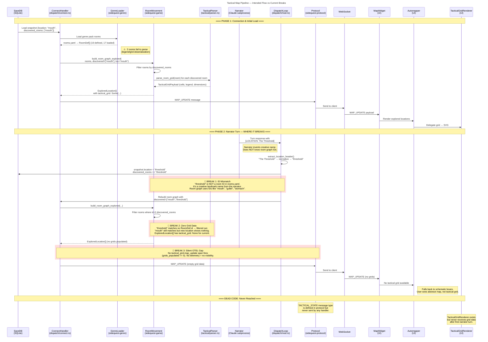

# Tactical Map Data Flow

Shows the intended pipeline for tactical grid rendering and where wiring currently breaks.

## Pipeline Diagram

## Root Cause

The narrator generates creative location names (`"The Threshold"`, `"The Gullet's Edge"`) that are normalized and stored as the player's current location. These names never match the mechanical room IDs defined in `rooms.yaml` (`"mouth"`, `"gullet"`, `"stomach"`).

Once the first narrator turn fires, every subsequent `build_room_graph_explored` call filters against `discovered_rooms` containing narrator-invented names that match zero `RoomDef` entries.

## Additional Issues

| Issue | Detail |
|---|---|
| **17/19 rooms loaded** | 2 rooms fail during parse — likely legend or grid deserialization errors in `rooms.yaml` |
| **TACTICAL_STATE unused** | Protocol message defined but no handler sends it |
| **Daemon tactical_sketch** | Tier config exists in daemon but is never called (Phase 1 is client-side SVG) |
| **No narrator constraint** | Narrator prompt does not include room graph IDs or instructions to use them |

## Fix Direction

The narrator must either:
1. Be constrained to emit room graph IDs (add room ID list to narrator system prompt), or
2. A mapping layer must resolve creative names to room IDs (fuzzy match / alias table in `cartography.yaml`)

Option 1 is simpler but constrains narrator creativity. Option 2 preserves narrator freedom but adds a resolution step that can fail.
