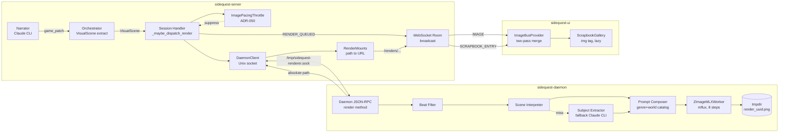
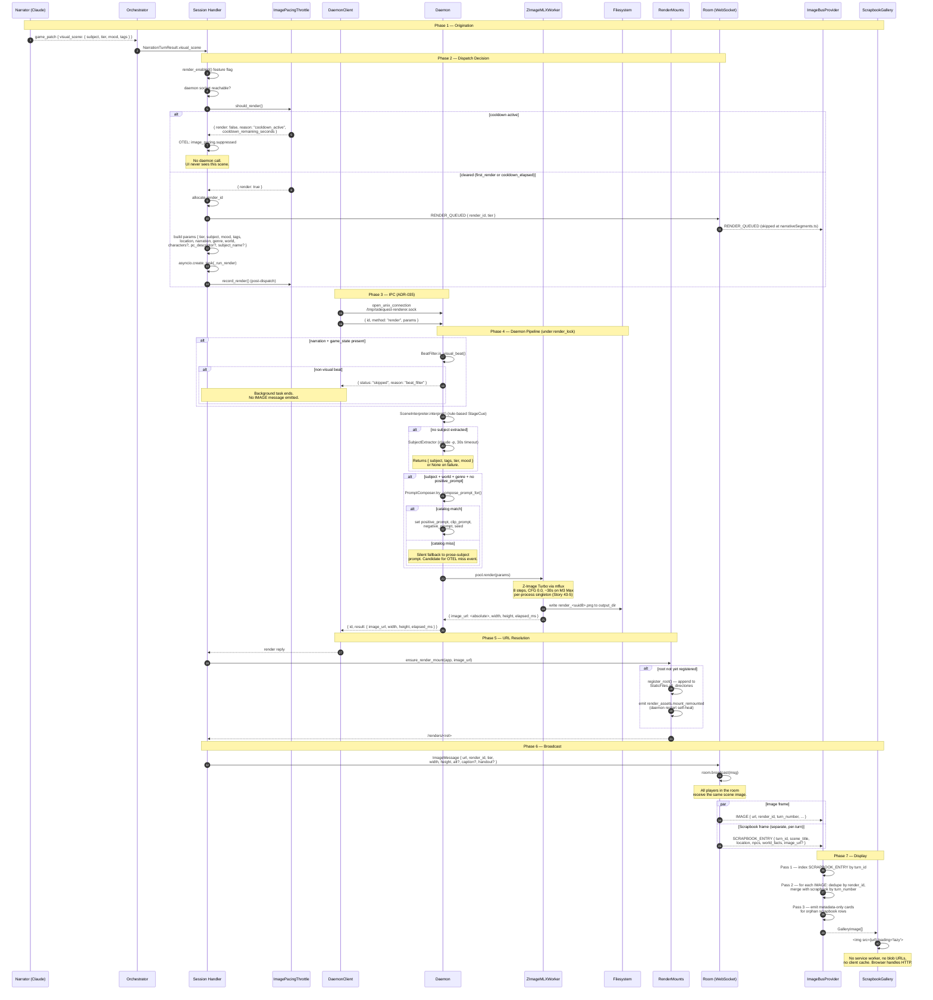

# Image Rendering — Sequence

> One scene image's life, from narrator intent to pixels in the player's gallery.
> Spans server (`sidequest-server`), media daemon (`sidequest-daemon`), and UI
> (`sidequest-ui`). Related ADRs: 035 (Unix socket IPC), 046 (GPU memory budget),
> 050 (image pacing throttle), 070 (MLX renderer).

## System Overview

## Phase Map

| Phase | Owner | What happens |
|-------|-------|--------------|
| 1. Origination | Narrator | Emits `visual_scene` block in `game_patch` |
| 2. Dispatch decision | Server | Feature flag, daemon health, throttle check |
| 3. IPC | Server / Daemon | Unix socket JSON-RPC, per-request connection |
| 4. Render pipeline | Daemon | Filter → interpret → compose → MLX render → write file |
| 5. URL resolution | Server | Self-healing static mount, absolute path → `/renders/*` |
| 6. Broadcast | Server | `IMAGE` message to all room players |
| 7. Display | UI | Merge with scrapbook metadata, render in gallery |

## Diagram

## Failure & Suppression Modes

| Path | Where | Player visible? |
|------|-------|-----------------|
| Throttle cooldown | `image_pacing.py:88` | No — OTEL only |
| Daemon unreachable | `_maybe_dispatch_render` health check | No — render skipped |
| Beat filter rejects | `daemon.py:329` | No — empty reply |
| Subject extraction fails | `subject_extractor.py` (Claude CLI 30s timeout) | No — render skipped |
| Catalog miss | `prompt_composer.py` | Yes — styleless prose-subject prompt |
| Daemon restart mid-session | `render_mounts.py:172` | Yes — mount re-registers, next render works |
| Worker exception | `_run_render` task | No — error logged, no IMAGE emitted |

## Tier-Specific Forks

The dispatch builds different params per tier:

- **`portrait`** — adds `subject_name` (initials overlay) and `pc_descriptor` (PC catalog ref `pc:<slug>`); `characters: ["pc:<slug>"]`.
- **`scene_illustration` / `landscape` / `text_overlay` / `fog_of_war`** — base params only.
- **`portrait_square`** — fixed 1024x1024 dimensions per `zimage_config.py`.

> The `cartography` tier and the `MAP_UPDATE` wire pipeline that fed
> `MapOverlay` were removed 2026-04-28 with the rest of the cartography
> subsystem (see ADR-019, superseded). The live world-map view did not
> survive the Rust → Python port (ADR-082). World-topology authoring
> via `world.cartography.yaml` and `CartographyConfig` is unaffected
> and remains owned by ADR-055 (room graph navigation).

## Channels Compared

| Image source | Transport | Display |
|--------------|-----------|---------|
| Scene illustrations, landscapes | `IMAGE` message + `SCRAPBOOK_ENTRY` | `ScrapbookGallery` |
| Character portraits | `PARTY_STATUS.portrait_url` | `CharacterPanel` |
| World hero (lobby) | REST genres metadata | `WorldPreview` |
| Render in flight | `RENDER_QUEUED` | Discarded by client (transient state only) |

## Key Files

| Component | Path |
|-----------|------|
| Narrator visual_scene contract | `sidequest-server/sidequest/agents/orchestrator.py:151` |
| Server dispatcher | `sidequest-server/sidequest/server/websocket_session_handler.py:2072` |
| Throttle (ADR-050) | `sidequest-server/sidequest/server/image_pacing.py` |
| Daemon client | `sidequest-server/sidequest/daemon_client/client.py` |
| Render mounts (URL) | `sidequest-server/sidequest/server/render_mounts.py` |
| Image protocol | `sidequest-server/sidequest/protocol/messages.py:357` (`ImagePayload`), `:710` (`ImageMessage`) |
| Daemon JSON-RPC | `sidequest-daemon/sidequest_daemon/media/daemon.py:327` |
| Beat filter | `sidequest-daemon/sidequest_daemon/renderer/beat_filter.py` |
| Scene interpreter | `sidequest-daemon/sidequest_daemon/media/scene_interpreter.py` |
| Subject extractor | `sidequest-daemon/sidequest_daemon/media/subject_extractor.py` |
| Prompt composer | `sidequest-daemon/sidequest_daemon/media/prompt_composer.py` |
| MLX worker (ADR-070) | `sidequest-daemon/sidequest_daemon/media/workers/zimage_mlx_worker.py` |
| Tier configs | `sidequest-daemon/sidequest_daemon/media/zimage_config.py` |
| GPU memory manager (ADR-046) | `sidequest-daemon/sidequest_daemon/ml/memory_manager.py` |
| Image bus (UI consolidation) | `sidequest-ui/src/providers/ImageBusProvider.tsx` |
| Gallery display | `sidequest-ui/src/components/GameBoard/widgets/ScrapbookGallery.tsx` |
