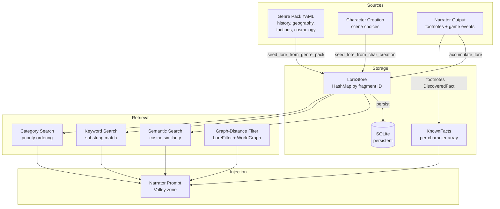
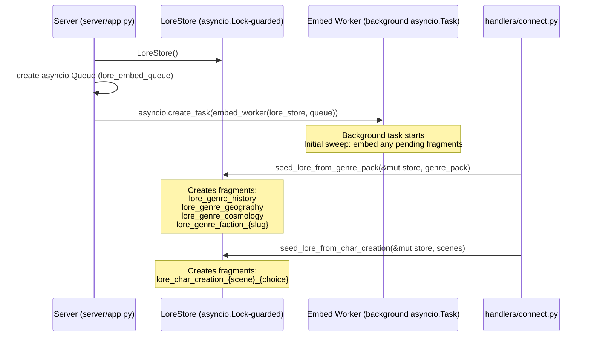
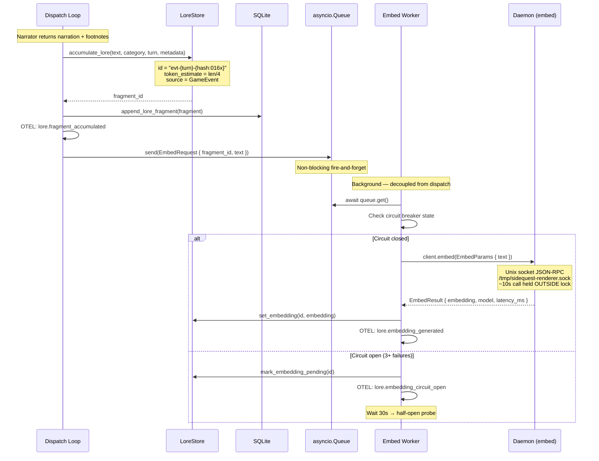
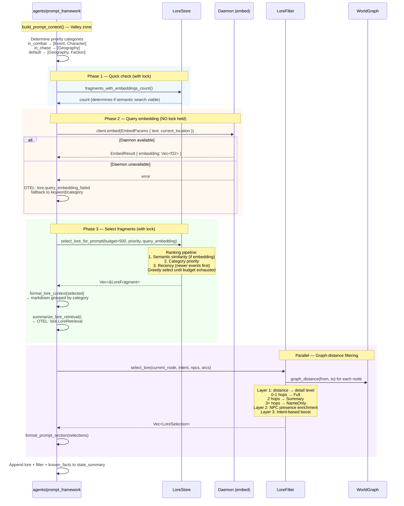
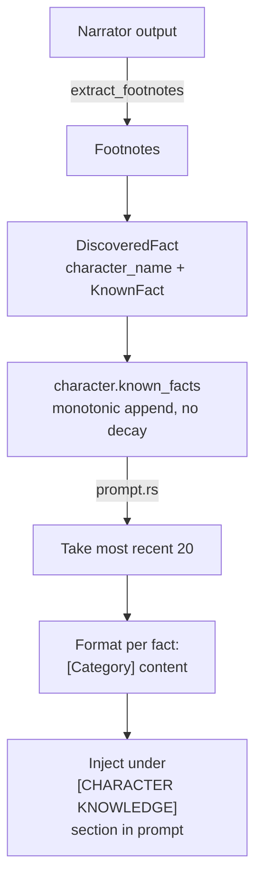
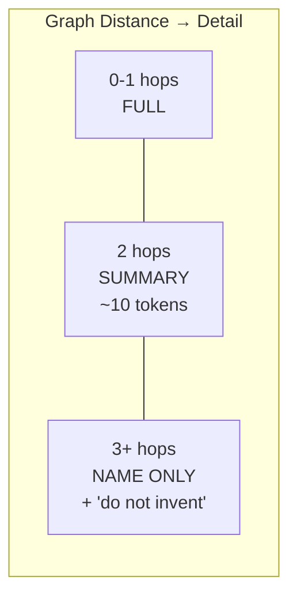

# Lore Storage and Retrieval

> **Last updated:** 2026-05-05 (post-port; ADR-082)
>
> Knowledge indexing with category/keyword/semantic search, budget-aware prompt injection,
> and background embedding via the Python daemon. Two parallel systems feed the narrator:
> LoreStore (world knowledge) and KnownFacts (character knowledge).
>
> Module paths reference `sidequest-server/sidequest/` (Python). The pre-port
> Rust crate paths in earlier revisions of this document have been retired —
> see `docs/adr/082-port-api-rust-to-python.md`.

## System Overview



## Session Initialization



## Turn-by-Turn: Accumulation and Embedding



## Prompt Injection: Budget-Aware Selection



## KnownFact Injection



**KnownFact fields:**
- `content` — fact in genre voice
- `learned_turn` — when discovered
- `source` — Observation, Dialogue, Discovery, Backstory
- `confidence` — Certain, Suspected, Rumored
- `category` — Lore, Place, Person, Quest, Ability

## LoreFilter Detail Levels



The NameOnly tier includes a closed-world assertion: "do not invent details about locations you only know by name." This prevents narrator hallucination about distant locations.

**Enrichment layers** override distance-based filtering:
- **NPC presence:** NPCs in the current scene pull their faction/culture to Full regardless of distance
- **Intent-based:** Combat boosts faction lore, Dialogue boosts culture+faction, Exploration boosts location

## LoreFragment Data Model

```
LoreFragment (pydantic v2 model)
├── id: str (deterministic: "evt-{turn}-{hash}" or "lore_genre_{section}")
├── category: LoreCategory (StrEnum)
│   └── History | Geography | Faction | Character | Item | Event | Language | Custom
├── content: str (narrative text)
├── token_estimate: int (~chars/4)
├── source: LoreSource
│   └── GenrePack | CharacterCreation | GameEvent
├── turn_created: int | None
├── metadata: dict[str, str]
├── embedding: list[float] | None  (from daemon)
└── embedding_pending: bool (retry flag)
```

## Key Files

| File | Purpose |
|------|---------|
| `sidequest-server/sidequest/game/lore_store.py` | `LoreStore`, query methods, embedding management |
| `sidequest-server/sidequest/game/lore_seeding.py` | `seed_lore_from_genre_pack`, `seed_lore_from_char_creation` |
| `sidequest-server/sidequest/game/lore_embedding.py` | Cross-process embedding via daemon (ADR-048); cosine similarity |
| `sidequest-server/sidequest/game/character.py` | `KnownFact`, `DiscoveredFact`, `FactCategory` |
| `sidequest-server/sidequest/agents/prompt_framework/` (`core.py`, `soul.py`, `types.py`) | `build_prompt_context`, lore injection pipeline |
| `sidequest-server/sidequest/server/dispatch/lore_embed.py` | Per-turn embedding fan-out / accumulate-and-persist |
| `sidequest-server/sidequest/daemon_client/` | Daemon embedding RPC client (Unix socket, ADR-035) |
| `sidequest-server/sidequest/telemetry/spans/lore.py` + `rag.py` | OTEL span definitions (lore + RAG) |

## OTEL Events

| Event | Type | When |
|-------|------|------|
| `lore.fragment_accumulated` | StateTransition | Fragment added (category, turn, tokens) |
| `lore.fragment_persisted` | StateTransition | Saved to SQLite |
| `lore.embedding_generated` | StateTransition | Vector attached (latency_ms, model) |
| `lore.embedding_pending` | ValidationWarning | Marked for retry (daemon failure) |
| `lore.embedding_circuit_open` | ValidationWarning | 3+ consecutive failures |
| `lore.semantic_retrieval` | StateTransition | Fragment selection (fallback, count) |
| `lore.LoreRetrieval` | Custom | Full budget breakdown (selected, rejected, tokens) |
| `lore.query_embedding_failed` | ValidationWarning | Daemon unreachable for query |
| `rag.known_facts_injected` | Summary | Character knowledge count |
| `rag.lore_injected_to_prompt` | Traced | Fragment count, tokens, categories |
