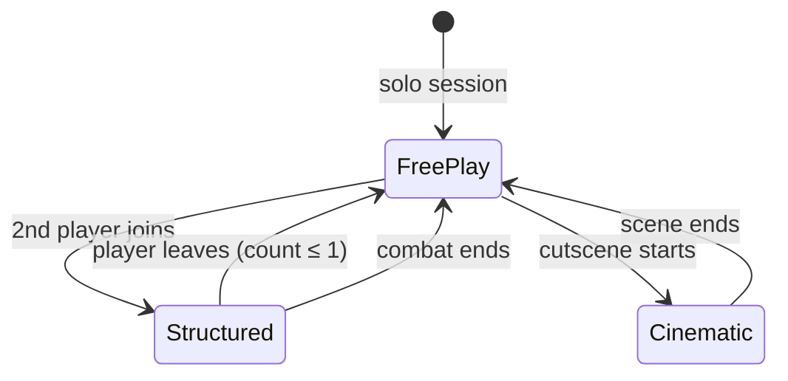
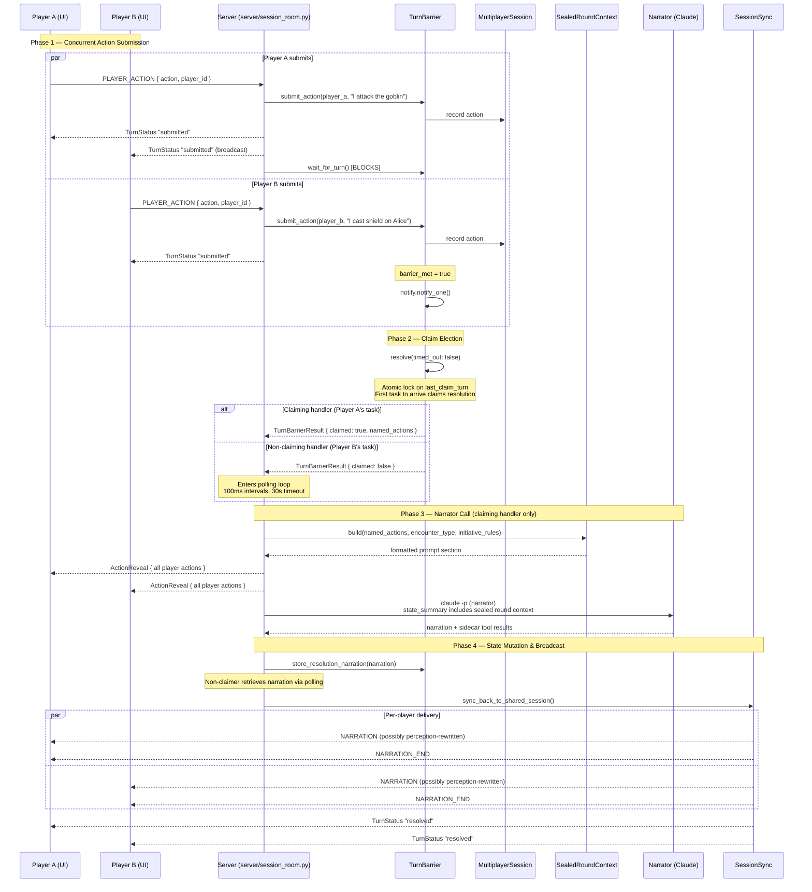
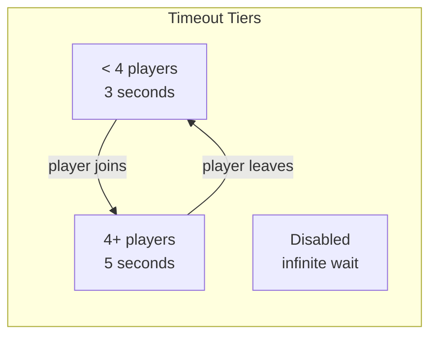
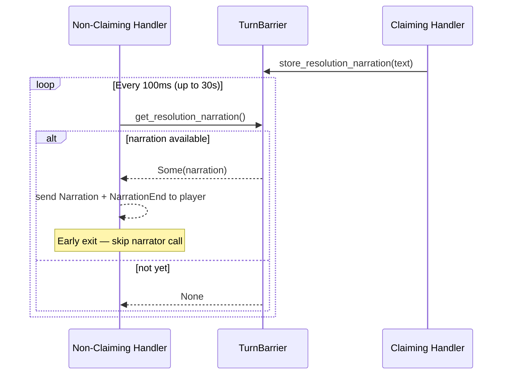
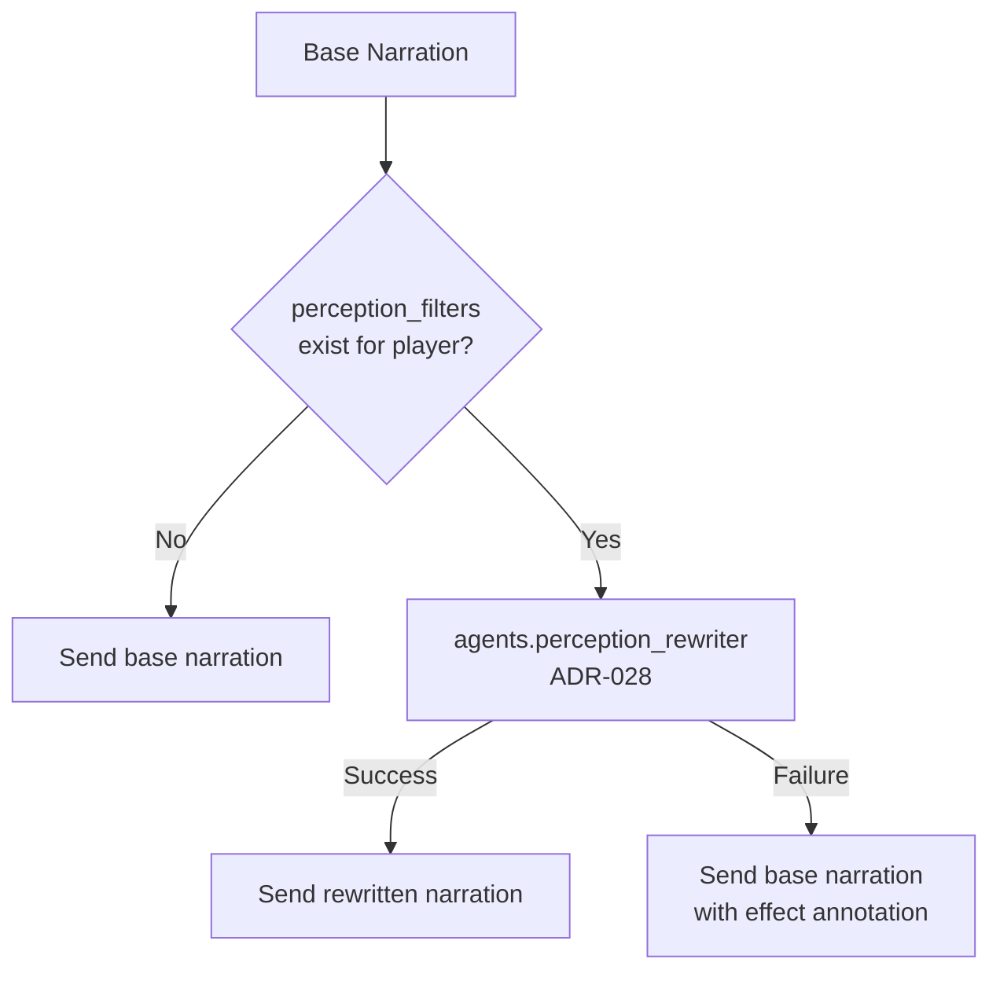

# Multiplayer Sealed Letter Turns

> **Last updated:** 2026-05-05 (post-port; ADR-082)
>
> Simultaneous action submission with claim-based narrator resolution.
> Players submit privately behind a barrier; one narrator call resolves all actions.
>
> Module paths reference `sidequest-server/sidequest/` (Python). The pre-port
> Rust crate paths in earlier revisions of this document have been retired —
> see `docs/adr/082-port-api-rust-to-python.md`.

## Turn Mode Activation

Barrier is only active in **Structured** and **Cinematic** modes. FreePlay resolves actions immediately (no barrier).

## Sealed Turn Sequence

## Adaptive Timeout

When timeout fires, missing players get auto-resolved with "hesitates" actions (mode-aware: "remains silent" for Cinematic).

## Non-Claimer Polling

## Perception Rewriting

After resolution, each player may receive a different version of the narration based on active `PerceptualEffect`s (blinded, charmed, hallucinating, etc.). This is now an in-narrator subsystem (ADR-067 unified narrator) — the standalone resonator agent of the pre-port architecture was collapsed into the unified narrator.

## Key Files

| File | Purpose |
|------|---------|
| `sidequest-server/sidequest/server/session_room.py` | `SessionRoom`, `TurnBarrier`, claim election, adaptive timeout |
| `sidequest-server/sidequest/game/session.py` | Per-session state, `TurnMode` (FreePlay / Structured / Cinematic) |
| `sidequest-server/sidequest/game/shared_world_delta.py` | Shared-world delta handshake (story 45-1) |
| `sidequest-server/sidequest/server/session_handler.py` | Multiplayer dispatch path |
| `sidequest-server/sidequest/handlers/player_action.py` | PLAYER_ACTION inbound handler |
| `sidequest-server/sidequest/handlers/action_reveal.py` | Sealed-letter reveal dispatch |
| `sidequest-server/sidequest/server/dispatch/sealed_letter.py` | Phase-5 sealed-letter dispatch (used by dogfight + magic confrontation outcomes) |
| `sidequest-server/sidequest/agents/perception_rewriter.py` | Per-player narration variants (ADR-028) |
| `sidequest-server/sidequest/game/projection_filter.py` + `game/projection/` | Per-player view computation |

## OTEL Events

| Event | When |
|-------|------|
| `sealed_round.claim_election` | Claim resolved (claimed, timed_out, missing_players) |
| `sealed_round.effective_action` | Combined action text sent to narrator |
| `sealed_round.poll_result` | Non-claimer retrieval (success/timeout, attempts) |
| `barrier.resolved` | Barrier complete (player_count, submitted, timed_out) |
| `perception.rewrite` | Per-player narration variant generated |
| `multiplayer.narration_broadcast` | Final narration sent (observer_count, text_len) |
