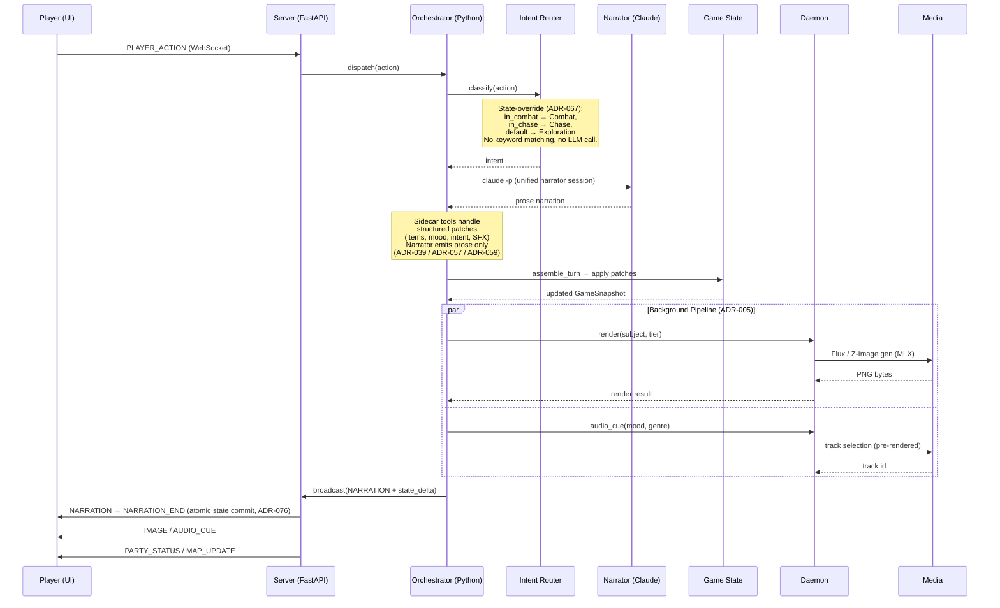
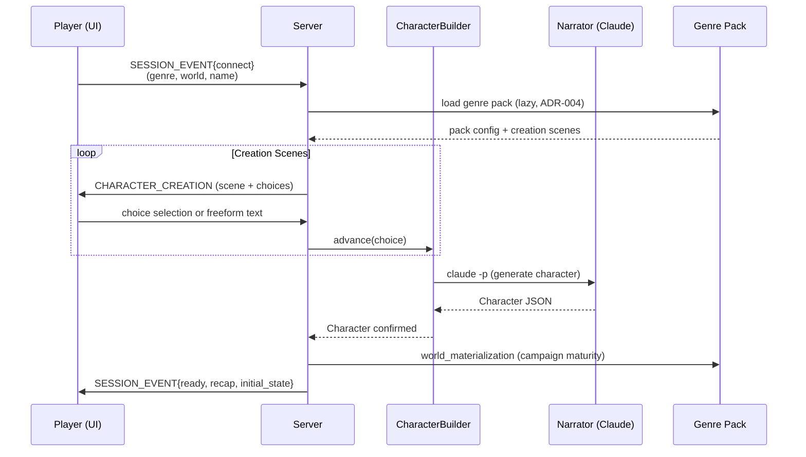

# SideQuest System Architecture

How the four repositories coordinate to run the SideQuest AI Narrator.

> **Last updated:** 2026-04-30 (post-port; backend is Python per ADR-082)

## Repository Ecosystem

```mermaid
graph TB
    subgraph "Orchestrator (oq-1 / oq-2)"
        ORC[orc-quest<br/>Sprint tracking, scripts,<br/>cross-repo justfile, ADRs]
    end

    subgraph "Game Engine (sidequest-server, Python)"
        SERVER[sidequest.server<br/>FastAPI HTTP/WebSocket]
        AGENTS[sidequest.agents<br/>Claude CLI orchestration<br/>Unified narrator + auxiliary]
        GAME[sidequest.game<br/>State, encounter, tropes,<br/>NPCs, lore, pacing]
        GENRE[sidequest.genre<br/>YAML pack loader, models]
        PROTO[sidequest.protocol<br/>pydantic GameMessage union]
        DCLIENT[sidequest.daemon_client<br/>Unix socket client]
        TELEMETRY[sidequest.telemetry<br/>OTEL spans + watcher]
    end

    subgraph "React Client (sidequest-ui)"
        UI[React 19 + TypeScript<br/>Game client, audio engine,<br/>3D dice overlay (proposed),<br/>GM Mode dashboard]
    end

    subgraph "Media Services (sidequest-daemon, Python)"
        FLUX[Flux / Z-Image Worker<br/>MLX image generation]
        MIXER[Audio Library<br/>+ pygame mixer]
    end

    subgraph "Asset Library (sidequest-content)"
        PACKS[Genre Packs<br/>genre_packs/ — production<br/>genre_workshopping/ — staging<br/>YAML, audio, images, worlds]
    end

    UI -->|WebSocket /ws| SERVER
    UI -->|REST /api/*| SERVER
    SERVER --> AGENTS
    SERVER --> GAME
    SERVER --> TELEMETRY
    AGENTS --> GAME
    GAME --> GENRE
    SERVER --> PROTO
    UI --> PROTO
    SERVER -->|Unix socket| DCLIENT
    DCLIENT -->|JSON-RPC| FLUX

    PACKS -.->|SIDEQUEST_GENRE_PACKS| GENRE
    PACKS -.->|SIDEQUEST_GENRE_PACKS| FLUX
    PACKS -.->|pre-rendered tracks| MIXER
    ORC -.->|just commands| SERVER
    ORC -.->|just commands| UI
    ORC -.->|just commands| FLUX

    classDef py fill:#306998,stroke:#333,color:#fff
    classDef ts fill:#3178c6,stroke:#333,color:#fff
    classDef yaml fill:#cb171e,stroke:#333,color:#fff
    classDef orch fill:#6c757d,stroke:#333,color:#fff

    class SERVER,AGENTS,GAME,GENRE,PROTO,DCLIENT,TELEMETRY,FLUX,MIXER py
    class UI ts
    class PACKS yaml
    class ORC orch
```

> The backend was briefly a Rust workspace (`sidequest-api`, ~2026-03-30 to
> 2026-04-19), then ported back to Python per **ADR-082** (cutover completed
> 2026-04-23). The Rust tree is preserved read-only at
> <https://github.com/slabgorb/sidequest-api>. Older diagrams that still show
> `sidequest-api` or Rust crates have been retired in favor of this one.

## Communication Protocols

| Path | Protocol | Format |
|------|----------|--------|
| UI ↔ Server | WebSocket (`/ws`) | JSON `GameMessage` discriminated union (pydantic v2) |
| UI → Server | REST (`/api/*`) | JSON (genres, save/load, dashboard) |
| UI → Server | WebSocket (`/ws/watcher`) | JSON OTEL events for GM Mode (ADR-090 — restoring) |
| Server → Daemon | Unix socket (`/tmp/sidequest-renderer.sock`) | Newline-delimited JSON-RPC (ADR-035) |
| Server → Claude | Subprocess (`claude -p`) | Stdin prompt, stdout response (ADR-001) |
| Content → All | Filesystem path | YAML + binary assets (Git LFS) |

## Data Flow: Game Turn



## Data Flow: Character Creation



## Data Flow: Media Pipeline

```mermaid
sequenceDiagram
    participant O as Orchestrator
    participant SE as Subject Extractor
    participant BF as Drama Gate
    participant RQ as Render Queue
    participant DC as Daemon Client
    participant FX as Flux / Z-Image Worker (MLX)
    participant MX as Audio Library

    O->>SE: extract(narration)
    Note over SE: Narrator's visual_scene<br/>preferred (game_patch);<br/>regex fallback only.
    SE-->>O: subjects + tiers

    O->>BF: should_render?(drama_weight)
    Note over BF: TensionTracker drama_weight<br/>+ pacing throttle (ADR-050)<br/>30s solo / 60s multiplayer
    alt drama_weight > threshold
        BF-->>O: render
        O->>RQ: enqueue(subject, tier)
        RQ->>DC: render request (JSON-RPC, ADR-035)
        DC->>FX: generate image
        FX-->>DC: PNG bytes
        DC-->>RQ: RenderResult
    else low drama
        BF-->>O: suppress
    end

    O->>DC: audio_cue(mood, genre)
    DC->>MX: play(pre-rendered track, channel)
    Note over MX: Channels: music + SFX only.<br/>TTS voice pipeline removed (ADR-076).
```

The standalone `BeatFilter` and `SceneRelevanceValidator` modules from the Rust
era did not port — drama-gate logic is currently inline. ADR-087 verdicts:
beat filter **RESTORE P3**, scene relevance validator **REDESIGN P2** under
ADR-086 (image composition taxonomy). Speculative prerendering (ADR-044) also
absent — RESTORE P2.

## Repository Responsibilities

### orc-quest (Orchestrator — oq-1 / oq-2)
- Cross-repo coordination via `justfile`
- Sprint tracking and story management (Pennyfarthing)
- Architecture docs, Architecture Decision Records, design artifacts (`docs/`)
- Asset generation scripts (POI images, music, portraits)
- System-level documentation (this file)
- Two parallel checkouts (oq-1 and oq-2) used for concurrent work; both have their own `sidequest-server`/`sidequest-ui`/`sidequest-daemon`/`sidequest-content` subrepos.

### sidequest-server (Python / FastAPI)
- Game engine: state, encounter, tropes, progression, room graph, scenarios, belief state
- Agent orchestration: unified Opus narrator (ADR-067) with auxiliary agents (resonator, troper, world_builder)
- WebSocket server: real-time game communication (ADR-038)
- Session management: connect → create → play lifecycle, with `SessionRoom` for multiplayer (ADR-036/037)
- SQLite persistence: save/load game state (ADR-006); `sqlite3` via `asyncio.to_thread`
- Pacing engine: tension model, drama-aware delivery
- Multiplayer: turn barriers, perception rewriting (ADR-028)
- Input sanitization: protocol-layer prompt injection defense (ADR-047)
- OTEL telemetry: 40+ named spans covering local DM, projection, multiplayer, narrator, render pipeline
- Lethality arbiter, projection filter, StateDelta — Python-era additions documented in the post-port audit

### sidequest-ui (TypeScript / React)
- Game client: narrative display, character sheets, inventory, map
- Audio engine: two-channel mixer (music + SFX), crossfader; no TTS pipeline
- 3D dice overlay: Three.js + Rapier (ADR-075, proposed)
- GM Mode: real-time telemetry dashboard (ADR-090 — restoring against Python OTEL spans)
- Genre theming: CSS variable injection from pack config (ADR-079)

### sidequest-daemon (Python sidecar)
- Image generation: Flux.1 (schnell + dev) and Z-Image Turbo via MLX (ADR-070)
- Audio library playback: pre-rendered ACE-Step tracks, mood-indexed rotation
- Audio mixing: pygame-ce (music + SFX channels only — TTS retired)
- GPU memory coordination: LRU model eviction across budget (ADR-046)

### sidequest-content
- Genre pack YAML configs — `genre_packs/` (production) + `genre_workshopping/` (staging). 5 fully-loadable production packs as of 2026-04-30; see `docs/genre-pack-status.md`.
- Audio assets (pre-rendered music, SFX)
- Image assets (portraits, POI landscapes; live world maps removed 2026-04-28 with ADR-019 supersession)
- World data (history, factions, cultures, regions)
- Fonts and visual style assets

## Port-Drift Reference

The post-port subsystem inventory and restoration scheduling live at:

- `docs/port-drift-feature-audit-2026-04-24.md` — Architect's audit of what landed in Python vs what stayed in Rust
- `docs/adr/087-post-port-subsystem-restoration-plan.md` — verdict and tier per non-parity subsystem
- `docs/adr/README.md` — port-era reading guide and Rust-to-Python translation table
