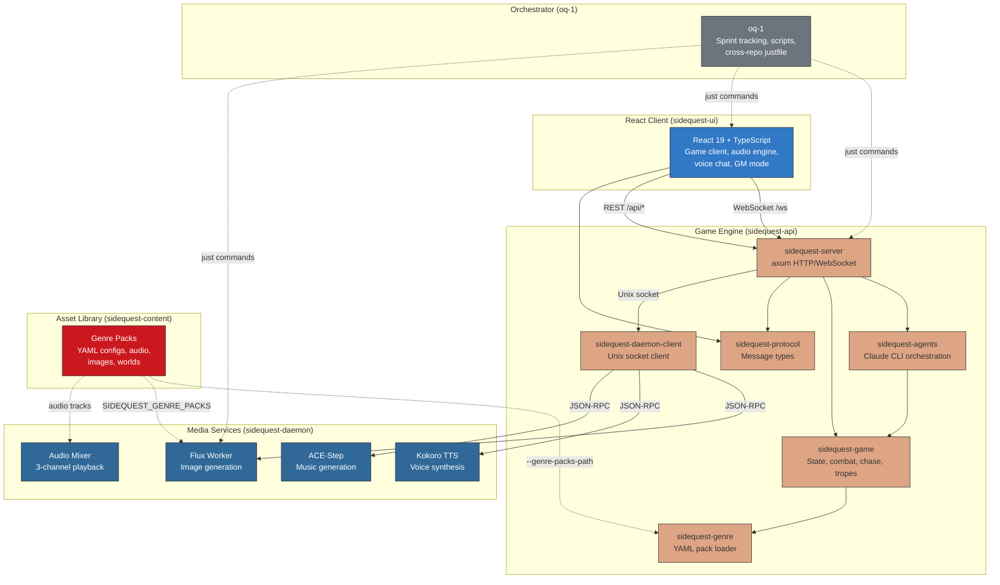
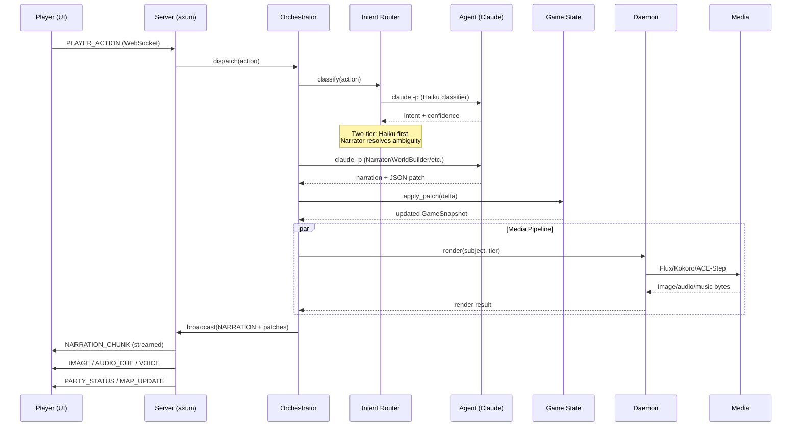
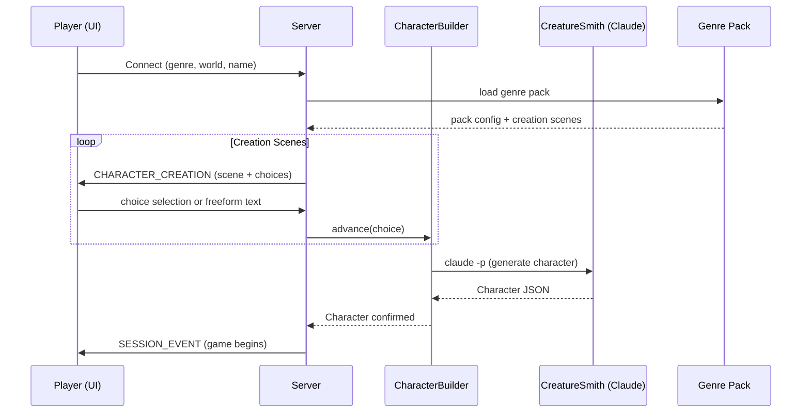
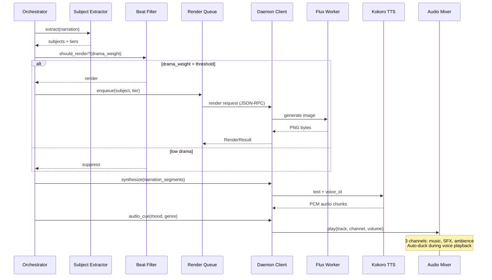

# SideQuest System Architecture

How the four repositories coordinate to run the SideQuest AI Narrator.

## Repository Ecosystem

## Communication Protocols

| Path | Protocol | Format |
|------|----------|--------|
| UI ↔ API | WebSocket (`/ws`) | JSON `GameMessage` enum |
| UI → API | REST (`/api/*`) | JSON (genres, save/load) |
| API → Daemon | Unix socket (`/tmp/sidequest-renderer.sock`) | Newline-delimited JSON-RPC |
| API → Claude | Subprocess (`claude -p`) | Stdin prompt, stdout response |
| Content → All | Filesystem path | YAML + binary assets (Git LFS) |

## Data Flow: Game Turn

## Data Flow: Character Creation

## Data Flow: Media Pipeline

## Repository Responsibilities

### oq-1 (Orchestrator)
- Cross-repo coordination via `justfile`
- Sprint tracking and story management
- Architecture docs, ADRs, design artifacts
- Asset generation scripts (POI images, music, portraits)
- System-level documentation (this file)

### sidequest-api (Rust)
- Game engine: state, combat, chase, tropes, progression
- Agent orchestration: 7 Claude-powered agents
- WebSocket server: real-time game communication
- Session management: connect → create → play lifecycle
- SQLite persistence: save/load game state
- Pacing engine: tension model, drama-aware delivery
- Multiplayer: turn barriers, perception rewriting

### sidequest-ui (TypeScript/React)
- Game client: narrative display, character sheets, inventory, map
- Audio engine: 3-channel mixer, crossfade, ducking
- Voice: push-to-talk with local Whisper transcription
- WebRTC: peer-to-peer voice chat between players
- GM Mode: real-time telemetry dashboard
- Genre theming: CSS variable injection from pack config

### sidequest-daemon (Python)
- Image generation: Flux.1 (schnell + dev), 6 render tiers
- Voice synthesis: Kokoro TTS (54 voices, blending, streaming)
- Music generation: ACE-Step (prompt-based, configurable duration)
- Audio mixing: pygame-ce, 3 named channels, ducking

### sidequest-content (Git LFS)
- Genre pack YAML configs (7 packs)
- Audio assets (music, SFX, ambience)
- Image assets (portraits, POI landscapes, maps)
- World data (history, factions, cultures)
- Fonts and visual style assets
