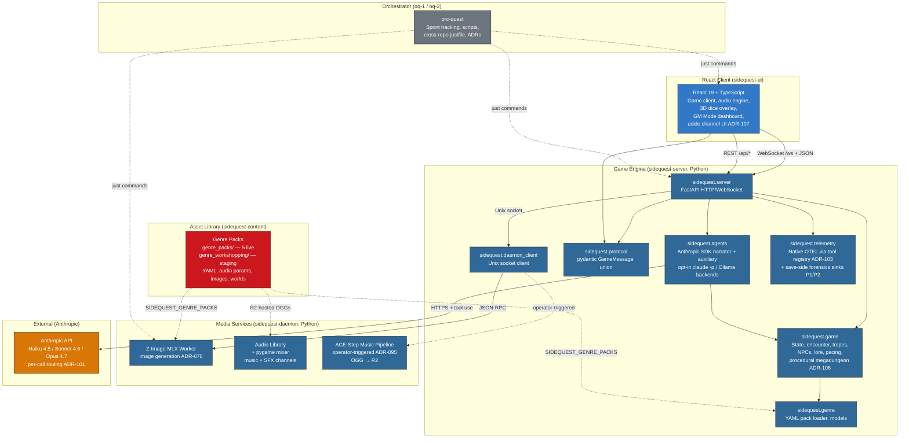
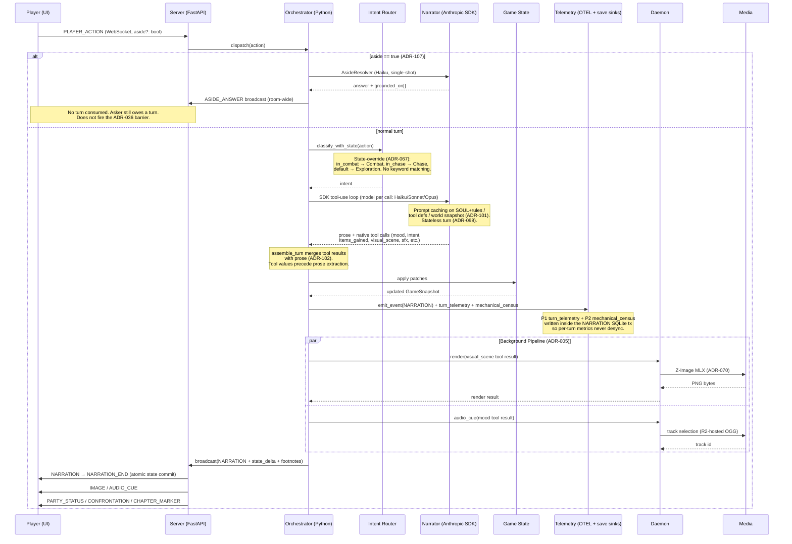

# SideQuest System Architecture

How the four repositories coordinate to run the SideQuest AI Narrator.

> **Last updated:** 2026-05-18 (post-ADR-101 SDK cutover; ADR-106 megadungeon
> closed; forensics telemetry P1+P2 live; ADR-107 aside channel accepted)

## Repository Ecosystem



> The backend was briefly a Rust workspace (`sidequest-api`, ~2026-03-30 to
> 2026-04-19), then ported back to Python per **ADR-082** (cutover completed
> 2026-04-23). The Rust tree is preserved read-only at
> <https://github.com/slabgorb/sidequest-api>.

## Communication Protocols

| Path | Protocol | Format |
|------|----------|--------|
| UI ↔ Server | WebSocket (`/ws`) | JSON `GameMessage` discriminated union (pydantic v2) |
| UI → Server | REST (`/api/*`) | JSON (`/api/genres`; save-forensics endpoints under `/api/debug/*` and `/timeline`) |
| UI → Server | WebSocket (`/ws/watcher`) | JSON OTEL events for GM Mode (ADR-090) |
| Server → Daemon | Unix socket (`/tmp/sidequest-renderer.sock`) | Newline-delimited JSON-RPC (ADR-035) |
| Server → Anthropic | HTTPS (Anthropic Python SDK) | Tool-use messages, prompt caching, per-call model routing (ADR-101 / ADR-102) |
| Server → Anthropic | HTTPS (subprocess `claude -p`) | Opt-in only; daemon-side subject extraction and ADR-106 dungeon "curate" stage |
| Server → Jaeger | gRPC (OTEL) | Native tool-registry spans (ADR-103) |
| Content → All | Filesystem path | YAML + Git-LFS binary assets (legacy); audio OGGs and new images served from R2 |

## Data Flow: Game Turn (SDK / Tool-Use Path)



## Data Flow: Character Creation

```mermaid
sequenceDiagram
    participant P as Player (UI)
    participant S as Server
    participant B as CharacterBuilder
    participant N as Narrator (Anthropic SDK)
    participant G as Genre Pack

    P->>S: SESSION_EVENT{connect}<br/>(genre, world, name)
    S->>G: load genre pack (lazy, ADR-004)
    G-->>S: pack config + creation scenes

    loop Creation Scenes
        S->>P: CHARACTER_CREATION (scene + choices)
        P->>S: choice selection or freeform text
        S->>B: advance(choice)
    end

    B->>N: SDK call (build character JSON via tool-use)
    N-->>B: Character
    B-->>S: Character confirmed
    S->>G: world_materialization (campaign maturity)
    Note over S,G: For caverns_and_claudes/beneath_sunden,<br/>ADR-106 expansion engine seeds the<br/>surface anchor; the deep is procedural.
    S->>P: SESSION_EVENT{ready, recap, initial_state}
```

## Data Flow: Media Pipeline

```mermaid
sequenceDiagram
    participant O as Orchestrator
    participant SE as Subject Extractor
    participant BF as Drama Gate
    participant RQ as Render Queue
    participant DC as Daemon Client
    participant FX as Z-Image MLX Worker
    participant MX as Audio Library

    O->>SE: extract(narration)
    Note over SE: Narrator's visual_scene<br/>(native tool call ADR-102)<br/>preferred; regex fallback only.
    SE-->>O: subjects + tiers

    O->>BF: should_render?(drama_weight)
    Note over BF: TensionTracker drama_weight<br/>+ pacing throttle (ADR-050)<br/>30s solo / 60s multiplayer
    alt drama_weight > threshold
        BF-->>O: render
        O->>RQ: enqueue(subject, tier)
        RQ->>DC: render request (JSON-RPC, ADR-035)
        DC->>FX: generate image (Z-Image Turbo, no negative prompts)
        FX-->>DC: PNG bytes → R2 upload
        DC-->>RQ: RenderResult{url}
    else low drama
        BF-->>O: suppress
    end

    O->>DC: audio_cue(mood tool result, genre)
    DC->>MX: play(R2-hosted OGG, channel)
    Note over MX: Channels: music + SFX only.<br/>TTS retired 2026-04 (ADR-076).<br/>ACE-Step generation is operator-triggered<br/>build-time only (ADR-095).
```

The standalone `BeatFilter` and `SceneRelevanceValidator` modules from the Rust
era did not port — drama-gate logic is currently inline. ADR-087 verdicts:
beat filter **RESTORE P3**, scene relevance validator **REDESIGN P2** under
ADR-086 (image composition taxonomy). Speculative prerendering (ADR-044) also
absent — RESTORE P2.

## Data Flow: Forensics Telemetry (lie-detector path)

```mermaid
sequenceDiagram
    participant T as Turn Pipeline
    participant E as emit_event
    participant DB as SQLite (save.db)
    participant J as Jaeger (gRPC)
    participant V as Forensics Viewer

    T->>E: NARRATION emitted (with conn)
    activate E
    E->>DB: INSERT events (narration row)
    E->>DB: INSERT turn_telemetry<br/>(model, tokens, cost, latency, tool counts)
    E->>DB: INSERT mechanical_census<br/>(per-PC edge/xp/inv/trope + diff lane)
    Note over E,DB: All three writes share the NARRATION<br/>transaction so per-turn metrics never<br/>desync from the event they describe.
    deactivate E

    T->>J: tool-registry OTEL spans (ADR-103)
    Note over J: Native — each tool call emits<br/>a span; no sidecar scraper.<br/>Old ADR-058 playtest_otlp pipe<br/>only feeds legacy dashboard panes.

    V->>DB: open_save_readonly(path)
    Note over V,DB: NEVER SqliteStore.open() —<br/>that path WAL-flips + schema-migrates<br/>+ commits on construction.
    DB-->>V: read-only cursor
    V->>V: fold KnownFacts by fact_id (ADR-100)
```

## Repository Responsibilities

### orc-quest (Orchestrator — oq-1 / oq-2)
- Cross-repo coordination via `justfile`
- Sprint tracking and story management (Pennyfarthing)
- Architecture docs, Architecture Decision Records, design artifacts (`docs/`)
- Asset generation scripts (POI images, music, portraits)
- System-level documentation (this file)
- Two parallel checkouts (oq-1 and oq-2) used for concurrent work; both have
  their own `sidequest-server`/`sidequest-ui`/`sidequest-daemon`/`sidequest-content`
  subrepos. Story IDs can collide if both clones run `sm-setup` in parallel —
  fetch+pull before setup; renumber the second-to-merge if push is rejected.

### sidequest-server (Python / FastAPI)
- Game engine: state, encounter, tropes, progression, room graph, scenarios,
  belief state, **ADR-106 procedural megadungeon engine** (Sünden Deep
  expansion loop + Complication Ledger)
- Agent orchestration: Anthropic SDK narrator (default, ADR-101) with auxiliary
  agents; native tool-use protocol (ADR-102); native OTEL via tool registry
  (ADR-103); stateless turns (ADR-098)
- WebSocket server: real-time game communication (ADR-038)
- Session management: connect → create → play lifecycle, with `SessionRoom`
  for multiplayer (ADR-036/037); aside channel resolver (ADR-107)
- SQLite persistence: save/load game state (ADR-006); `sqlite3` via
  `asyncio.to_thread`; forensics sinks `turn_telemetry` + `mechanical_census`
  ride the NARRATION transaction
- Pacing engine: tension model, drama-aware delivery
- Multiplayer: turn barriers, perception rewriting at the tool layer
  (ADR-104), broadcast-layer firewall (ADR-105)
- Input sanitization: protocol-layer prompt injection defense (ADR-047)
- OTEL telemetry: native tool-registry spans (ADR-103), narrator cost
  telemetry (`llm.request` span carries model, tokens, cache hits, cost USD)
- `open_save_readonly` API for forensic save access (never `SqliteStore.open()`)

### sidequest-ui (TypeScript / React)
- Game client: narrative display, character sheets, inventory, journal
- Audio engine: two-channel mixer (music + SFX), crossfader; no TTS
- 3D dice overlay: Three.js + Rapier (ADR-075, partial)
- GM Mode: real-time telemetry dashboard (ADR-090) + save-forensics viewer
- Genre theming: CSS variable injection from pack config (ADR-079); loud-fail
  when genre theme CSS never arrives after connect
- Aside channel UI (ADR-107): out-of-band OOC input with peer-visible mirror

### sidequest-daemon (Python sidecar)
- Image generation: **Z-Image Turbo via MLX** (`zimage_mlx_worker.py`,
  ADR-070); composition tiers per ADR-086; no negative prompts (prose bleeds
  as text); prompting guide at `sidequest-content/PROMPTING_Z_IMAGE.md`
- Music generation: **ACE-Step**, operator-triggered (ADR-095); per-track
  `*_input_params.json` in `sidequest-content` is canonical; daemon produces
  OGG → R2
- Cavern maps: Python-ported Cellular (ADR-096, partial)
- Audio mixing: pygame-ce (music + SFX channels only — TTS retired)
- GPU memory coordination: LRU model eviction across budget (ADR-046)

### sidequest-content
- Genre pack YAML configs — `genre_packs/` (production) + `genre_workshopping/`
  (staging). **5 live production packs** as of 2026-05-18: `caverns_and_claudes`
  (now backed by ADR-106 `beneath_sunden`), `elemental_harmony`,
  `mutant_wasteland`, `space_opera`, `tea_and_murder` (renamed from victoria).
  See `docs/genre-pack-status.md` for the lobby-selectable world matrix
  (the M2 reshuffle parked four worlds; current lobby surfaces
  `beneath_sunden`, `flickering_reach`, `coyote_star`, `glenross`).
- Audio assets — ACE-Step `*_input_params.json` per track in repo; OGG
  playback files live in R2 (`cdn.slabgorb.com`), not Git LFS (ADR-095)
- Image assets — portraits, POI landscapes; new generations upload to R2,
  not Git LFS. Live world maps removed 2026-04-28 (ADR-019 superseded)
- World data: history, factions, cultures, regions; the `beneath_sunden`
  world authors only the surface anchor — the dungeon is procedural at runtime
- Fonts and visual style assets

## Port-Drift Reference

The post-port subsystem inventory and restoration scheduling live at:

- `docs/port-drift-feature-audit-2026-04-24.md` — Architect's audit of what
  landed in Python vs what stayed in Rust
- `docs/adr/087-post-port-subsystem-restoration-plan.md` — verdict and tier
  per non-parity subsystem
- `docs/adr/DRIFT.md` — auto-generated list of accepted ADRs whose
  implementation is not yet `live`
- `docs/adr/README.md` — port-era reading guide and Rust-to-Python
  translation table
