# SideQuest — Wiring Diagrams

> End-to-end signal traces for every major feature. Each diagram shows the path
> from visible UI feature through server layers to storage, with module paths and
> function names.
>
> **Last updated:** 2026-04-30
> **Source of truth:** `sidequest-server/sidequest/` (Python tree, post-port per ADR-082).
> The pre-port Rust archive (`sidequest-api`) is read-only at
> <https://github.com/slabgorb/sidequest-api>; some diagrams below describe a
> subsystem that has not yet been re-wired in Python — those are flagged with
> a ⚠️ **port-drift** banner and a pointer to the ADR-087 verdict.

---

## Table of Contents

1. [Core Turn Loop](#1-core-turn-loop) — Action → Narration → State Delta
2. [Narrator Prompt Assembly](#2-narrator-prompt-assembly) — Attention Zones → Tiered Composition → Claude CLI
3. [Image Generation](#3-image-generation) — Narration → Subject → Drama Gate → Daemon → IMAGE
4. [TTS Voice Pipeline (removed)](#4-tts-voice-pipeline-removed) — Retired in Epic 27 / ADR-076
5. [Music & Audio](#5-music--audio) — Narration → Mood → Track Selection → AUDIO_CUE
6. [Multiplayer Turn Barrier](#6-multiplayer-turn-barrier) — Sealed Letter Collection → Resolution
7. [Combat & Encounter Flow](#7-combat--encounter-flow) — State Override → Mutations → COMBAT_EVENT
8. [Character Creation](#8-character-creation) — Builder State Machine → Character
9. [Pacing & Drama Engine](#9-pacing--drama-engine) — TensionTracker → Delivery Mode → Prompt
10. [Knowledge Pipeline](#10-knowledge-pipeline) — Footnotes → KnownFacts → Lore → Prompt
11. [NPC Personality (OCEAN)](#11-npc-personality-ocean) — Profiles → Behavioral Summary → Prompt
12. [Faction Agendas & Scene Directives](#12-faction-agendas--scene-directives) — Agendas → Directives → Narrator
13. [Slash Commands](#13-slash-commands) — /command → Router → Response
14. [Trope Engine](#14-trope-engine) — Tick → Beat Firing → Narrator Injection ⚠️ **partial**
15. [Session Persistence](#15-session-persistence) — GameSnapshot → SQLite → Recovery
16. [Genre Pack Loading](#16-genre-pack-loading) — YAML → Pydantic → Session State

---

## 1. Core Turn Loop

The central pipeline from player input to narrated response. All paths are Python modules under `sidequest-server/sidequest/`.

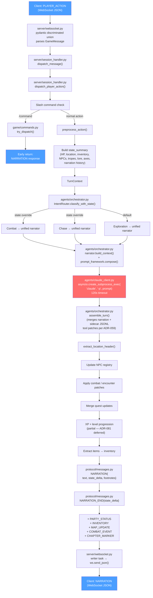

**Key files:** `server/websocket.py` → `server/session_handler.py` → `agents/orchestrator.py` → `agents/claude_client.py` → back through `session_handler.py`

**Sidecar tool model (ADR-059):** the narrator emits prose only. Mechanical state changes (mood, intent, items, quests, SFX, resource deltas, personality events, scene renders) are written by sidecar tools to JSONL during narration. `assemble_turn` merges tool results with narration, with tool values always taking precedence over any prose extraction.

**Storage touched:** NPC registry, quest log, inventory, XP/level, narration history, lore store

---

## 2. Narrator Prompt Assembly

How the narrator prompt is composed across attention zones, with Full vs Delta tiering (ADR-066). Lives entirely in `sidequest-server/sidequest/agents/prompt_framework/`.

```mermaid
flowchart TD
    subgraph TRIGGER["Trigger"]
        A["server/session_handler.py<br/>dispatch_player_action()"]
    end

    A --> B["agents/orchestrator.py<br/>IntentRouter.classify_with_state()<br/>State override — no keyword matching"]
    B --> C{"Game state?"}
    C -->|"in_combat"| C1["Intent.Combat"]
    C -->|"in_chase"| C2["Intent.Chase"]
    C -->|"default"| C3["Intent.Exploration"]

    C1 & C2 & C3 --> D{"First turn<br/>of session?"}
    D -->|"yes"| E["Full Tier<br/>(~15KB system prompt)"]
    D -->|"no"| F["Delta Tier<br/>(dynamic state only)"]

    E & F --> G["agents/prompt_framework/<br/>core/ContextBuilder"]

    subgraph PRIMACY["Primacy Zone — Maximum Attention"]
        P1["narrator_identity"]
        P2["narrator_constraints<br/>Silent constraint handling"]
        P3["narrator_agency<br/>PC puppet prevention + multiplayer"]
        P4["narrator_consequences<br/>Genre tone alignment"]
        P5["narrator_output_only ★<br/>Sidecar-tool emission rules<br/>(prose only; tools handle patches)"]
        P6["genre_identity ★"]
    end

    subgraph EARLY["Early Zone — High Attention"]
        E1["narrator_output_style"]
        E2["narrator_combat_rules ★"]
        E3["narrator_chase_rules<br/>If in_chase"]
        E4["narrator_dialogue_rules ★"]
        E5["soul_principles<br/>From SOUL.md (filtered per agent)"]
        E6["trope_beat_directives<br/>(currently dark — ADR-087 RESTORE P1)"]
    end

    subgraph VALLEY["Valley Zone — Moderate Attention"]
        V1["game_state ★<br/>HP, inventory, quests,<br/>known facts, tropes,<br/>resources, party roster"]
        V2["ocean_personalities<br/>NPC behavioral summaries"]
        V3["ability_context<br/>Character involuntary abilities"]
        V4["world_lore<br/>Graph-filtered by distance<br/>(game/lore_*.py)"]
        V5["merchant_context<br/>(deferred — see ADR-087)"]
        V6["world_context<br/>History chapters by maturity"]
        V7["genre_resources<br/>Current/max, decay rates"]
        V8["sfx_library<br/>Available SFX IDs"]
    end

    subgraph LATE["Late Zone — Lower Attention"]
        L1["narrator_vocabulary<br/>Accessible / Literary / Epic"]
        L2["footnote_protocol<br/>Knowledge extraction rules"]
        L3["backstory_capture<br/>If intent == Backstory"]
    end

    subgraph RECENCY["Recency Zone — Highest Attention"]
        R1["narrator_verbosity ★<br/>Length limits"]
        R2["opening_scene_constraint<br/>First-turn length cap"]
        R3["player_action ★"]
    end

    G --> PRIMACY --> EARLY --> VALLEY --> LATE --> RECENCY

    RECENCY --> H{"Tier?"}
    H -->|"Full"| I["claude --model opus<br/>--session-id {UUID}<br/>--system-prompt {zones}<br/>-p {action}"]
    H -->|"Delta"| J["claude --model opus<br/>--resume {session_id}<br/>-p {zones + action}"]

    I & J --> K["Parse response (prose only)<br/>+ collect sidecar tool JSONL"]
    K --> L["assemble_turn:<br/>merge narration with<br/>tool-emitted patches"]
    L --> M["ActionResult<br/>→ back to session_handler"]

    style A fill:#6c5ce7,color:#fff
    style M fill:#6c5ce7,color:#fff
    style I fill:#ff6b6b,color:#fff
    style J fill:#ff6b6b,color:#fff
    style PRIMACY fill:#ff634720,stroke:#ff6347
    style EARLY fill:#ffa50020,stroke:#ffa500
    style VALLEY fill:#32cd3220,stroke:#32cd32
    style LATE fill:#4169e120,stroke:#4169e1
    style RECENCY fill:#9370db20,stroke:#9370db
```

**★ = injected on EVERY tier** (Full and Delta). Unmarked = Full tier only or conditional.

**Attention zone ordering:** Primacy (0) → Early (1) → Valley (2) → Late (3) → Recency (4). Sections added in any order; `compose()` sorts by zone before joining.

**Delta tier key rule:** `narrator_output_only` (sidecar-tool emission rules) is re-sent every turn — without it, the narrator stops emitting structured tool calls.

**Token telemetry:** Per-zone token estimates emitted via OTEL spans for the Prompt Inspector dashboard (ADR-090, restoration in progress).

**Trope-beat directives are partial.** `TropeState` data is ported to Python; the engine that fires beats from progression (`apply_trope_engagement`) is on ADR-087's RESTORE P1 list. Until restored, trope-beat directives are emitted as best-effort by the narrator without engine guarantees.

---

## 3. Image Generation

Background pipeline — narration triggers render, result arrives asynchronously via RENDER_QUEUED → IMAGE replacement. Daemon side runs in `sidequest-daemon` (separate Python process, Unix socket per ADR-035).

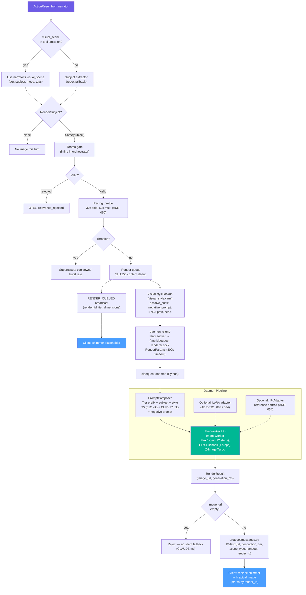

> ⚠️ **Port-drift status (ADR-087):**
> - Standalone `BeatFilter` module **dark** (RESTORE P3) — drama gate logic currently inline in orchestrator.
> - `SceneRelevanceValidator` **dark** (REDESIGN P2 under ADR-086 image-composition taxonomy).
> - `PrerenderScheduler` (speculative prerender, ADR-044) **dark** (RESTORE P2).

**Subject extraction:** Narrator's `visual_scene` (from sidecar tool emission) is preferred; regex fallback only.

**Render tiers:** portrait (768×1024), portrait_square (1024×1024), landscape (1024×768), scene_illustration (1024×768), text_overlay (768×512), fog_of_war (1024×1024). The `cartography` tier was removed 2026-04-28 along with the rest of the live world-map runtime view (ADR-019 superseded). The `tactical_sketch` tier was retired separately under ADR-086.

**Handout classification:** Discovery scenes and dialogue portraits flagged as `handout: true` → persisted in player journal.

---

## 4. TTS Voice Pipeline (removed)

The Kokoro TTS streaming pipeline was retired in **Epic 27 (MLX Image Renderer)**
when the sidequest-daemon was narrowed to a single-purpose Flux/Z-Image renderer.
The follow-up protocol cleanup landed in **ADR-076 / story 27-9**, which removed
the `NarrationChunk` message variant and `NarrationChunkPayload` from the
protocol module, and the corresponding UI narration buffer that was designed
to synchronize text reveal with incoming PCM voice frames.

Current narration delivery is the simplified two-message flow shown in
[Section 1 — Core Turn Loop](#1-core-turn-loop):

```
NARRATION { text, state_delta, footnotes }
NARRATION_END { state_delta }
```

The UI pairs `NARRATION` with its terminal `NARRATION_END` in a small buffer so
any end-of-turn `state_delta` applies in the same React commit as the narration
text. There is no longer any streaming-chunks leg, no binary voice frames, and
no audio ducking around speech. The audio mixer in `sidequest-daemon` runs
**two channels only** (music + SFX).

If TTS is reintroduced later, it will almost certainly use a different
streaming shape (e.g. a single `VoiceTrack` message with a URL reference, or
post-narration audio job queued like images are). See ADR-076 Alternatives
Considered for the rationale.

---

## 5. Music & Audio

Mood classification drives track selection over pre-rendered ACE-Step library tracks. Lives in `sidequest/audio/`.

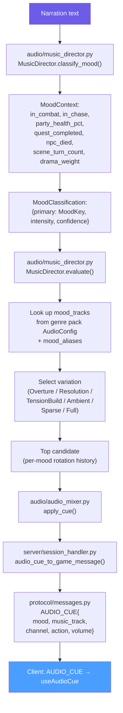

> ⚠️ **Port-drift status (ADR-087):** the standalone `ThemeRotator` module
> from the Rust era is **superseded** — TensionTracker plus narrative-weight
> traits (ADR-080) cover the pacing surface it provided. Per-mood rotation
> history is kept inline in `MusicDirector`. If a pacing gap surfaces later
> that the inline approach cannot serve, design fresh.

**Core moods (string-keyed, ADR-079):** Combat, Exploration, Tension, Triumph, Sorrow, Mystery, Calm. Genre packs declare any custom mood string in `audio.yaml` and map via `mood_aliases` to a core mood or directly to tracks.

**Variation selection (6-tier priority):** Overture (session start/location change) → Resolution (combat ended/quest completed) → TensionBuild (intensity ≥0.7 or drama ≥0.7) → Ambient (intensity ≤0.3 or scene turn ≥4) → Sparse (mid-intensity, low drama) → Full (fallback)

**MoodContext inputs:** in_combat, in_chase, party_health_pct, quest_completed, npc_died, encounter_mood_override, location_changed, scene_turn_count, drama_weight (from TensionTracker)

**2 channels:** music, sfx — each with independent volume and action (play/fade_in/fade_out/duck/restore/stop). Default volumes: music 0.7, sfx 0.8. The voice / TTS channel and ambience channel of earlier diagrams are **gone** (ADR-076).

**Client (useAudioCue.ts):** Routes AUDIO_CUE by action field — configure/duck/restore/fade_out/play. AudioEngine handles crossfade between tracks, AudioCache prevents re-decoding.

---

## 6. Multiplayer Turn Barrier

Sealed-letter pattern — all players submit, one elected handler resolves. Lives in `sidequest/server/session_room.py`.

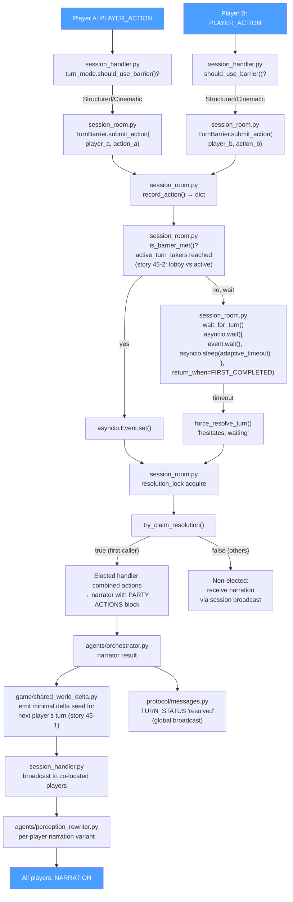

**Adaptive timeout:** 3s for 2-3 players, 5s for 4+ (configurable tiers)

**Resolution lock:** `asyncio.Lock` ensures exactly one task calls the narrator — others receive broadcast.

**Active turn-takers (story 45-2):** Barrier counts players whose characters have advanced past round 0, not raw lobby connections. Phantom lobby peers no longer block solo turns. OTEL emits `lobby_participant_count` vs `active_turn_count` on every barrier wait.

**Shared-world delta (story 45-1):** After each turn, `shared_world_delta` emits a minimal delta (current location, active encounter id, party formation/adjacency) that seeds the next player's turn so the narrator stops fabricating physical separations between party members.

**Perception filter:** If a player has perceptual effects active, their narration copy is prefixed with `[Your perception is altered: ...]`.

**Sealed-letter dispatch handler:** dark — see ADR-087 RESTORE P1. The barrier mechanism above lives in session_room; the **dedicated dispatch handler** that some scenarios route through is on the restoration roster.

---

## 7. Combat & Encounter Flow

State-override detection (ADR-067, no keyword matching), structured mutations, and CombatOverlay broadcast.

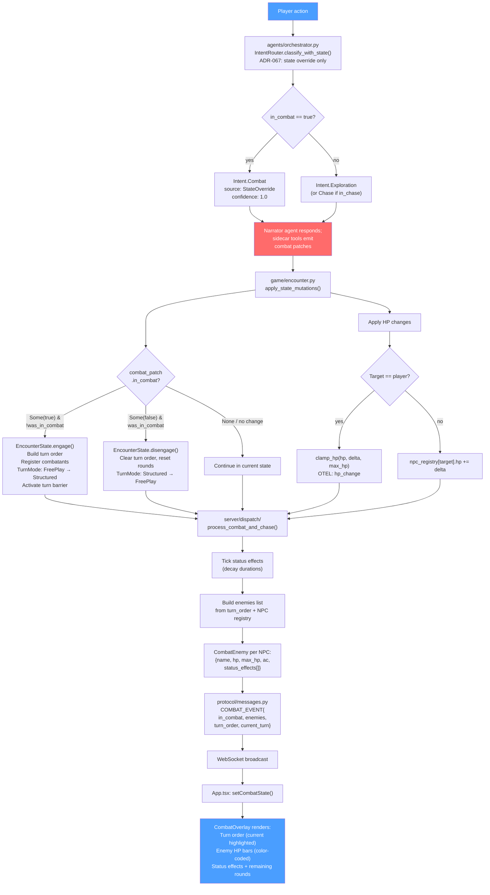

> ⚠️ **Port-drift status (ADR-087):** the chase engine (`chase_depth.rs`,
> `chase.rs`) **did not port**. There is no `chase.py` or `chase_depth.py` in
> the Python tree; only string references in `game/encounter.py`. ADR-087
> verdict: **RESTORE P2** under ADR-017. Chase intent still classifies
> correctly (state-override) but engine-side terrain, rig physics, and
> phase mechanics are not enforced.

**No keyword matching** — combat detection is purely state-driven (ADR-067). `in_combat` flag in game state triggers Intent.Combat.

**Turn mode FSM:** `FreePlay` ↔ `Structured` (on combat start/end), `FreePlay` → `Cinematic` (on cutscene)

**Encounter tracking:** round counter, turn_order, current_turn, damage log, status effects (Poison/Stun/Bless/Curse with duration decay), drama_weight, available_actions.

**HP bar colors:** green (>50%), orange (25-50%), red (<25%). Status indicators: "bloodied" at 50%, "defeated" at 0 HP.

**Confrontation engine (Epic 16/28):** `game/resource_pool.py` and the typed-confrontation framework ported. **VERIFY → likely RESTORE P0** per ADR-087 — Epic 28 was the largest body of work immediately pre-port and per-story landing has not been verified.

---

## 8. Character Creation

Genre-driven scene-based state machine with bidirectional messages.

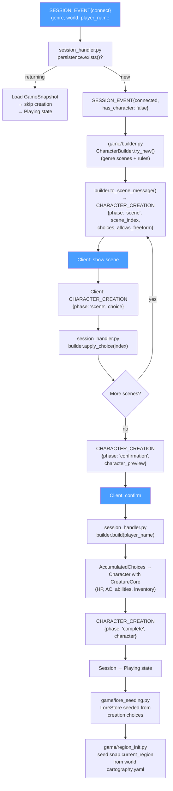

**Accumulated from scenes:** class, race, personality, items, affinity, backstory fragments, stat bonuses, pronouns, rig type, catch phrase

**3 creation modes (ADR-016):** Menu (pick from list), Guided (follow prompts), Freeform (describe anything)

**Region init:** Region/route world topology (`CartographyConfig`) lives in `world.cartography.yaml` and seeds `snap.current_region` at chargen — this is the residual cartography wiring that survived the 2026-04-28 ADR-019 supersession. The live runtime world-map view is gone.

---

## 9. Pacing & Drama Engine

Dual-track tension model drives narration length and delivery speed. Lives in `sidequest/game/tension_tracker.py`.

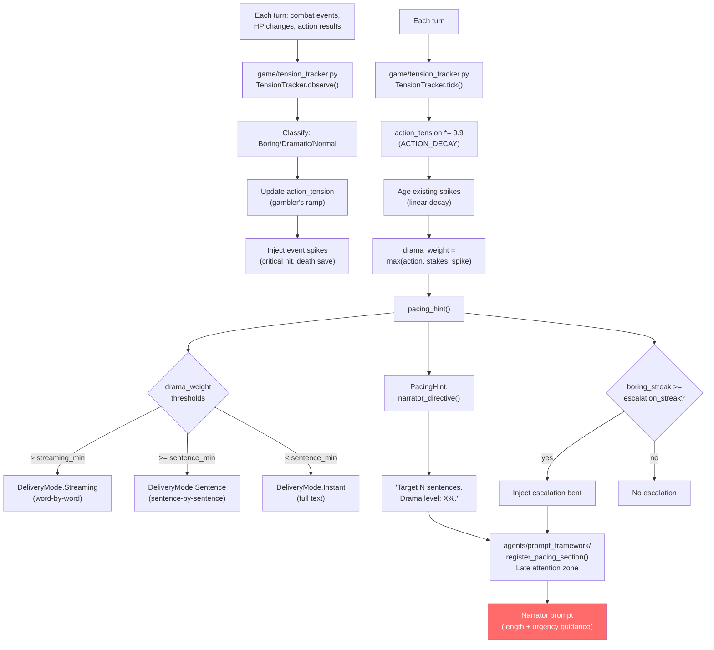

**Genre-tunable:** `pacing.yaml` in genre pack sets `streaming_delivery_min`, `sentence_delivery_min`, `escalation_streak`

**Dual tracks:** Action tension (gambler's ramp from boring streaks) + Stakes tension (HP ratio) + Event spikes (discrete dramatic moments)

---

## 10. Knowledge Pipeline

Narrator footnotes become persistent facts that feed back into future prompts. Lives in `sidequest/game/lore_*.py` + `sidequest/game/character.py` (KnownFact).

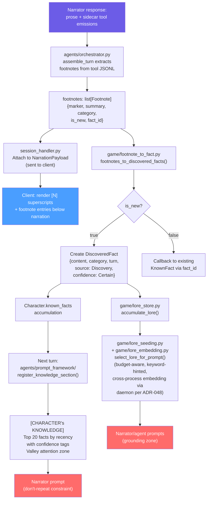

**FactCategory:** Lore, Place, Person, Quest, Ability

**Lore budget:** Token-aware selection prevents prompt bloat (content.len / 4 token estimate).

**Lore filter:** dark — see ADR-087 RESTORE P2. Suitability filtering of LLM-output lore mint is currently absent.

**Feedback loop:** Footnotes → KnownFacts → prompt injection → narrator avoids repeating → new footnotes

---

## 11. NPC Personality (OCEAN)

Big Five profiles loaded from genre packs, summarized into narrator prompts. Lives in `sidequest/genre/models/ocean.py`.

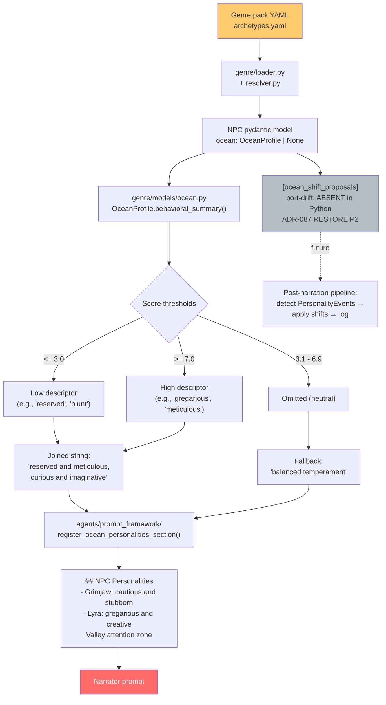

**5 dimensions:** Openness, Conscientiousness, Extraversion, Agreeableness, Neuroticism (0.0-10.0)

**Agreeableness → Disposition:** A-dimension feeds the `npc.disposition` scalar. The full Attitude enum + transition system from the Rust era **did not port** — disposition is currently a plain int with clamping. ADR-087 verdict: **RESTORE P1** under ADR-020.

**Gap:** OCEAN shift proposals — the engine that detects personality events from narration and applies live shifts — **did not port**. Model is present, pipeline is missing. ADR-042 design stands; restoration is on ADR-087's P2 list.

---

## 12. Faction Agendas & Scene Directives

Factions pursue goals that inject into every narrator turn. Data is ported; agenda urgency feeds scene directive injection.

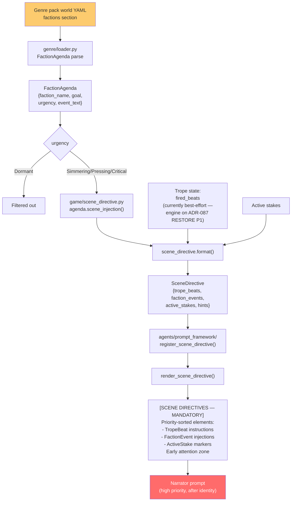

**Urgency levels:** Dormant (filtered), Simmering, Pressing, Critical

**Mandatory weave:** Scene directives use EARLY attention zone — narrator must incorporate them

---

## 13. Slash Commands

Server-side interception before intent classification. Python-era home is `sidequest/game/commands.py` (was server dispatch in Rust).

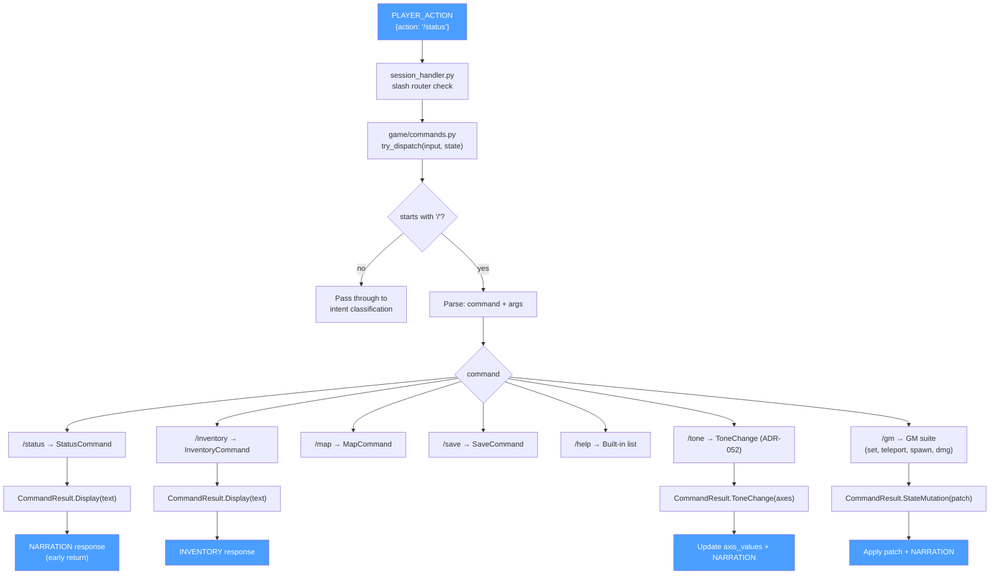

**No LLM call:** Slash commands resolve mechanically — no Claude subprocess, no intent classification.

**GM commands:** Protected by role check, allow direct state manipulation for debugging.

---

## 14. Trope Engine ⚠️ partial

> ⚠️ **Port-drift status (ADR-087 RESTORE P1, ADR-018 still accepted):**
> `TropeState` data ported to `sidequest/game/session.py` and progresses each
> turn, but the Rust `apply_trope_engagement` engine (driver selection,
> engagement outcomes, beat firing from threshold crossings) **did not
> port**. The diagram below describes the **design intent** of ADR-018; the
> "Fire beat" branch is currently best-effort by the narrator without engine
> guarantees. Restoration is wiring the engine back onto existing data.

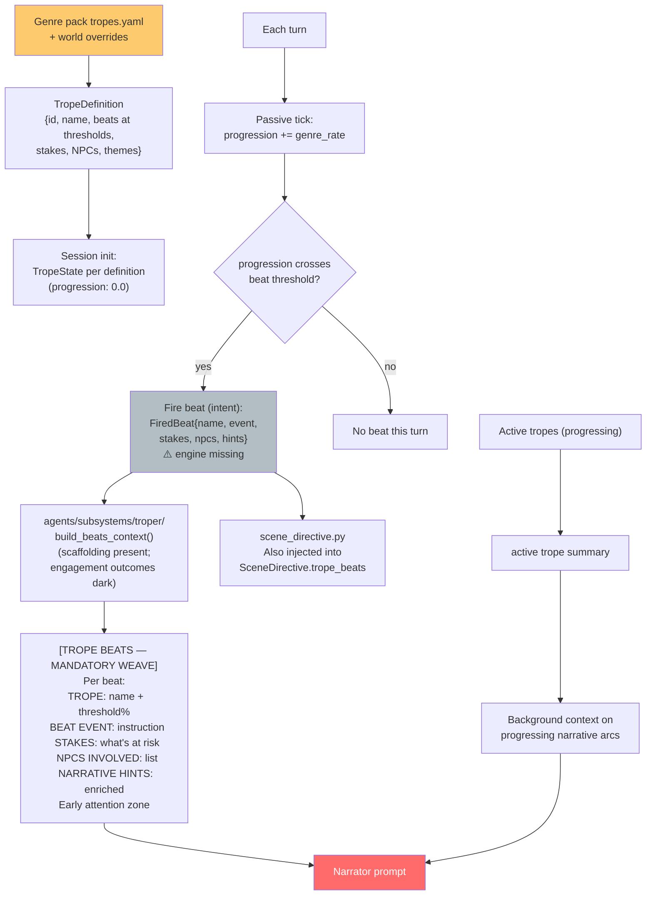

**Trope lifecycle (intent):** Progression 0.0 → 1.0 with beats firing at defined thresholds.

**Engagement multiplier (intent):** Scale progression rate by player engagement (turns_since_meaningful). Engine on ADR-087 P1.

---

## 15. Session Persistence

Atomic save after every turn, full recovery on reconnect. Lives in `sidequest/game/persistence.py` (stdlib `sqlite3` via `asyncio.to_thread`).

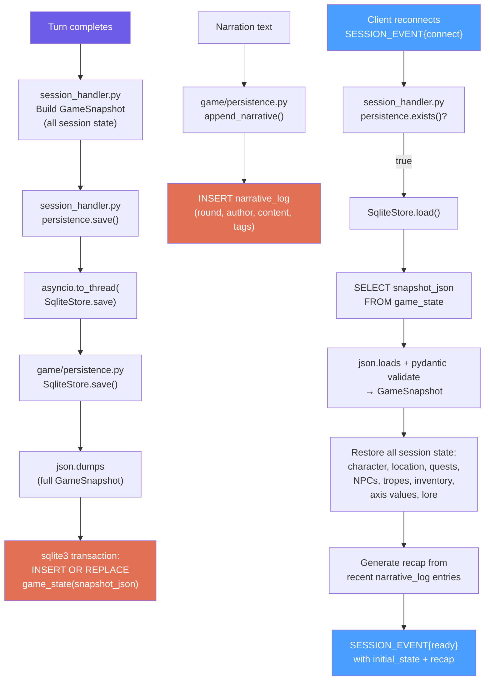

**Schema:** 3 tables — `session_meta`, `game_state` (single row, full JSON), `narrative_log` (append-only)

**Async pattern:** `sqlite3.Connection` is not safely shareable across asyncio tasks — DB calls run on a worker thread via `asyncio.to_thread` at the async boundary.

**One DB per session:** `~/.sidequest/saves/{genre}/{world}/{player}/save.db`

**GameSnapshot includes:** characters, NPCs, encounter, chase data (where ported), tropes (full TropeState), quests, lore, axis values, achievements, campaign maturity, world history, NPC registry

---

## 16. Genre Pack Loading

Lazy binding — packs loaded per-session on connect, not at startup. Lives in `sidequest/genre/loader.py`.

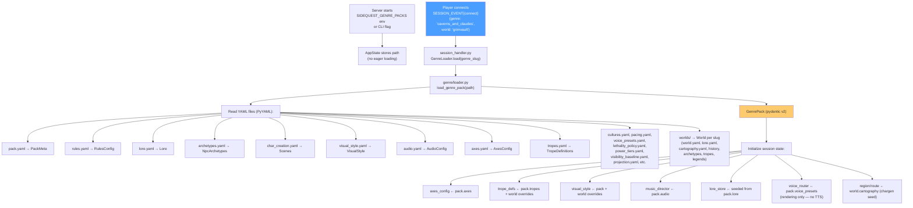

**15+ YAML files** per genre pack, all deserialized into typed pydantic models via PyYAML.

**World inheritance:** World-level overrides merge with genre-level defaults (tropes, visual style).

**Lazy binding (ADR-004):** Server starts genre-agnostic; genre bound at runtime on player connect.

**Production vs workshop:** `SIDEQUEST_GENRE_PACKS` always points at `sidequest-content/genre_packs/`. Five packs are functionally loadable (`caverns_and_claudes`, `elemental_harmony`, `mutant_wasteland`, `space_opera`, `victoria`); two production directories (`heavy_metal`, `spaghetti_western`) are empty shells with their content still in `sidequest-content/genre_workshopping/`. Four other packs (`low_fantasy`, `neon_dystopia`, `pulp_noir`, `road_warrior`) are workshop-only. See `docs/genre-pack-status.md`.

---

## Color Legend

```
Blue   (#4a9eff)  — Client/WebSocket messages (visible to player)
Purple (#6c5ce7)  — Internal data (narration text, results)
Red    (#ff6b6b)  — Claude CLI subprocess / narrator prompt
Green  (#00b894)  — Python daemon (Flux / Z-Image gen)
Orange (#e17055)  — SQLite persistence
Yellow (#fdcb6e)  — YAML configuration (genre packs)
Gray   (#b2bec3)  — Not yet wired in Python (port-drift; see ADR-087)
```

## Port-Drift Reference

Subsystems flagged with ⚠️ port-drift in this document have a verdict and tier
in `docs/adr/087-post-port-subsystem-restoration-plan.md`. The full
side-by-side inventory is at `docs/port-drift-feature-audit-2026-04-24.md`
(plus 2026-04-30 follow-up §9). Per ADR-082, the language port is complete;
per ADR-087, subsystem restoration is sequential P0 → P3 work.
