# SideQuest — Wiring Diagrams

> End-to-end signal traces for every major feature. Each diagram shows the path from
> visible UI feature through server layers to storage, with file paths and function names.
>
> **Last updated:** 2026-04-06
> **Source of truth:** `sidequest-api/crates/` — traced from actual code, not design docs.

---

## Table of Contents

1. [Core Turn Loop](#1-core-turn-loop) — Action → Narration → State Delta
2. [Narrator Prompt Assembly](#2-narrator-prompt-assembly) — Attention Zones → Tiered Composition → Claude CLI
3. [Image Generation](#3-image-generation) — Narration → Subject → Beat Filter → Daemon → IMAGE
4. [TTS Voice Pipeline (removed)](#4-tts-voice-pipeline-removed) — Retired in Epic 27 / ADR-076
5. [Music & Audio](#5-music--audio) — Narration → Mood → Track Selection → AUDIO_CUE
6. [Multiplayer Turn Barrier](#6-multiplayer-turn-barrier) — Sealed Letter Collection → Resolution
7. [Combat Flow](#7-combat-flow) — State Override → Mutations → COMBAT_EVENT
8. [Character Creation](#8-character-creation) — Builder State Machine → Character
9. [Pacing & Drama Engine](#9-pacing--drama-engine) — TensionTracker → Delivery Mode → Prompt
10. [Knowledge Pipeline](#10-knowledge-pipeline) — Footnotes → KnownFacts → Lore → Prompt
11. [NPC Personality (OCEAN)](#11-npc-personality-ocean) — Profiles → Behavioral Summary → Prompt
12. [Faction Agendas & Scene Directives](#12-faction-agendas--scene-directives) — Agendas → Directives → Narrator
13. [Slash Commands](#13-slash-commands) — /command → Router → Response
14. [Trope Engine](#14-trope-engine) — Tick → Beat Firing → Narrator Injection
15. [Session Persistence](#15-session-persistence) — GameSnapshot → SQLite → Recovery
16. [Genre Pack Loading](#16-genre-pack-loading) — YAML → Typed Structs → Session State

---

## 1. Core Turn Loop

The central pipeline from player input to narrated response.

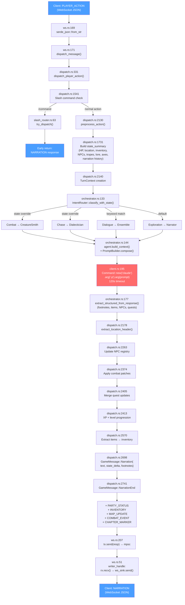

**Key files:** `ws.rs` → `dispatch.rs` → `orchestrator.rs` → `client.rs` → back through `dispatch.rs`

**Storage touched:** NPC registry, quest log, inventory, XP/level, narration history, lore store

---

## 2. Narrator Prompt Assembly

How the narrator prompt is composed from ~30 sections across 5 attention zones, with Full vs Delta tiering (ADR-066).

```mermaid
flowchart TD
    subgraph TRIGGER["Trigger"]
        A["dispatch_player_action()<br/>(dispatch/mod.rs)"]
    end

    A --> B["IntentRouter::classify_with_state()<br/>(intent_router.rs)<br/>State override — no keyword matching"]
    B --> C{"Game state?"}
    C -->|"in_combat"| C1["Intent::Combat"]
    C -->|"in_chase"| C2["Intent::Chase"]
    C -->|"default"| C3["Intent::Exploration"]

    C1 & C2 & C3 --> D{"First turn<br/>of session?"}
    D -->|"yes"| E["Full Tier<br/>(~15KB system prompt)"]
    D -->|"no"| F["Delta Tier<br/>(dynamic state only)"]

    E & F --> G["ContextBuilder<br/>(context_builder.rs)"]

    subgraph PRIMACY["Primacy Zone — Maximum Attention"]
        P1["narrator_identity<br/>'You are the Game Master…'"]
        P2["narrator_constraints<br/>Silent constraint handling"]
        P3["narrator_agency<br/>PC puppet prevention + multiplayer"]
        P4["narrator_consequences<br/>Genre tone alignment"]
        P5["narrator_output_only ★<br/>Complete game_patch schema<br/>(~150 lines, ALL fields)"]
        P6["genre_identity ★<br/>'You are narrating a {genre} game'"]
    end

    subgraph EARLY["Early Zone — High Attention"]
        E1["narrator_output_style<br/>Formatting rules"]
        E2["narrator_combat_rules ★<br/>Always injected (ADR-067)"]
        E3["narrator_chase_rules<br/>If in_chase"]
        E4["narrator_dialogue_rules ★<br/>Always injected"]
        E5["soul_principles<br/>From SOUL.md (filtered per agent)"]
        E6["trope_beat_directives<br/>MANDATORY scene elements"]
    end

    subgraph VALLEY["Valley Zone — Moderate Attention"]
        V1["game_state ★<br/>HP, inventory, quests,<br/>known facts, tropes,<br/>resources, party roster<br/>(dispatch/prompt.rs)"]
        V2["ocean_personalities<br/>NPC behavioral summaries"]
        V3["ability_context<br/>Character involuntary abilities"]
        V4["world_lore<br/>Graph-filtered by distance<br/>(lore_filter.rs)"]
        V5["merchant_context<br/>Available merchants + inventory"]
        V6["world_context<br/>History chapters by maturity"]
        V7["genre_resources<br/>Current/max, decay rates"]
        V8["sfx_library<br/>Available SFX IDs"]
    end

    subgraph LATE["Late Zone — Lower Attention"]
        L1["narrator_vocabulary<br/>Accessible / Literary / Epic"]
        L2["footnote_protocol<br/>Knowledge extraction rules"]
        L3["backstory_capture<br/>If intent == Backstory"]
    end

    subgraph RECENCY["Recency Zone — Highest Attention"]
        R1["narrator_verbosity ★<br/>Length limits in chars"]
        R2["opening_scene_constraint<br/>First-turn length cap"]
        R3["player_action ★<br/>'{character} says: {action}'"]
    end

    G --> PRIMACY --> EARLY --> VALLEY --> LATE --> RECENCY

    RECENCY --> H{"Tier?"}
    H -->|"Full"| I["claude --model opus<br/>--session-id {UUID}<br/>--system-prompt {zones}<br/>-p {action}"]
    H -->|"Delta"| J["claude --model opus<br/>--resume {session_id}<br/>-p {zones + action}"]

    I & J --> K["Parse JSON response"]
    K --> L["Extract:<br/>narration, game_patch,<br/>combat_patch, chase_patch,<br/>footnotes, items, NPCs,<br/>visual_scene, sfx_triggers,<br/>personality_events"]
    L --> M["ActionResult<br/>→ back to dispatch"]

    style A fill:#6c5ce7,color:#fff
    style M fill:#6c5ce7,color:#fff
    style I fill:#ff6b6b,color:#fff
    style J fill:#ff6b6b,color:#fff
    style PRIMACY fill:#ff634720,stroke:#ff6347
    style EARLY fill:#ffa50020,stroke:#ffa500
    style VALLEY fill:#32cd3220,stroke:#32cd32
    style LATE fill:#4169e120,stroke:#4169e1
    style RECENCY fill:#9370db20,stroke:#9370db
```

**★ = injected on EVERY tier** (Full and Delta). Unmarked = Full tier only or conditional.

**Attention zone ordering:** Primacy (0) → Early (1) → Valley (2) → Late (3) → Recency (4). Sections added in any order; `compose()` sorts by zone before joining.

**Delta tier key rule:** `narrator_output_only` (complete game_patch schema) is re-sent every turn — without it, the LLM stops emitting structured JSON.

**Token telemetry:** Per-zone token estimates emitted via OTEL for the Prompt Inspector dashboard.

---

## 3. Image Generation

Background pipeline — narration triggers render, result arrives asynchronously via RENDER_QUEUED → IMAGE replacement.

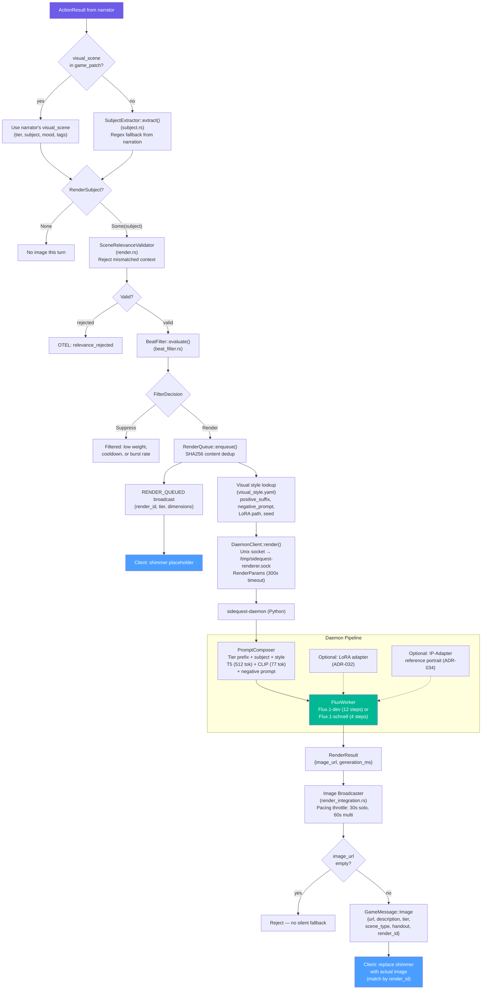

**Subject extraction:** Narrator's `visual_scene` (from game_patch) is preferred; regex `SubjectExtractor` is fallback only.

**Beat filter gates:** narrative weight (>0.4), cooldown (2-4 turns), burst rate (max 2/turn), SHA256 dedup.

**Render tiers:** portrait (768×1024), landscape (1024×768), scene_illustration (768×768), tactical_sketch (1024×1024), cartography (1024×1024), text_overlay (768×512).

**Handout classification:** Discovery scenes and dialogue portraits flagged as `handout: true` → persisted in player journal.

---

## 4. TTS Voice Pipeline (removed)

The Kokoro TTS streaming pipeline was retired in **Epic 27 (MLX Image Renderer)**
when the sidequest-daemon was narrowed to a single-purpose Flux image renderer.
The follow-up protocol cleanup landed in **ADR-076 / story 27-9**, which removed
the `GameMessage::NarrationChunk` variant and `NarrationChunkPayload` struct
from the protocol crate, and the corresponding UI narration buffer that was
designed to synchronize text reveal with incoming PCM voice frames.

Current narration delivery is the simplified two-message flow shown in
[Section 1 — Core Turn Loop](#1-core-turn-loop):

```
GameMessage::Narration { text, state_delta, footnotes }
GameMessage::NarrationEnd { state_delta }
```

The UI pairs `Narration` with its terminal `NarrationEnd` in a small buffer so
any end-of-turn `state_delta` applies in the same React commit as the narration
text. There is no longer any streaming-chunks leg, no binary voice frames, and
no audio ducking around speech.

If TTS is reintroduced later, it will almost certainly use a different
streaming shape (e.g. a single `VoiceTrack` message with a URL reference, or
post-narration audio job queued like images are). See ADR-076 Alternatives
Considered for the rationale.

---

## 5. Music & Audio

Mood classification drives track selection with anti-repetition rotation.

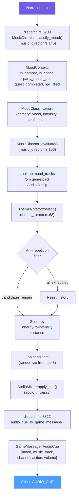

**Moods:** Combat, Exploration, Tension, Triumph, Sorrow, Mystery, Calm

**Variation selection (6-tier priority):** Overture (session start/location change) → Resolution (combat ended/quest completed) → TensionBuild (intensity ≥0.7 or drama ≥0.7) → Ambient (intensity ≤0.3 or scene turn ≥4) → Sparse (mid-intensity, low drama) → Full (fallback)

**MoodContext inputs:** in_combat, in_chase, party_health_pct, quest_completed, npc_died, encounter_mood_override, location_changed, scene_turn_count, drama_weight (from TensionTracker)

**3 channels:** music, sfx, ambience — each with independent volume and action (play/fade_in/fade_out/duck/restore/stop). Default volumes: music 0.7, sfx 0.8, voice 1.0, ambience 0.3.

**Rotation depth:** 3 tracks per mood before repeat allowed

**Client (useAudioCue.ts):** Routes AUDIO_CUE by action field — configure/duck/restore/fade_out/play. AudioEngine handles crossfade between tracks, AudioCache prevents re-decoding.

---

## 6. Multiplayer Turn Barrier

Sealed letter pattern — all players submit, one handler resolves.

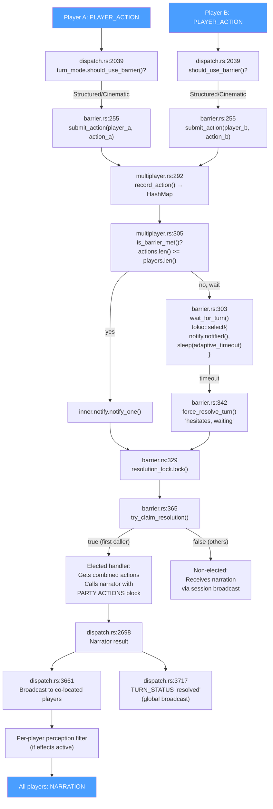

**Adaptive timeout:** 3s for 2-3 players, 5s for 4+ (configurable tiers)

**Resolution lock:** `Mutex` ensures exactly one tokio task calls the narrator — others receive broadcast

**Perception filter:** If a player has perceptual effects, their narration copy is prefixed with `[Your perception is altered: ...]`

---

## 7. Combat Flow

State-override detection (ADR-067, no keyword matching), structured mutations, and CombatOverlay broadcast.

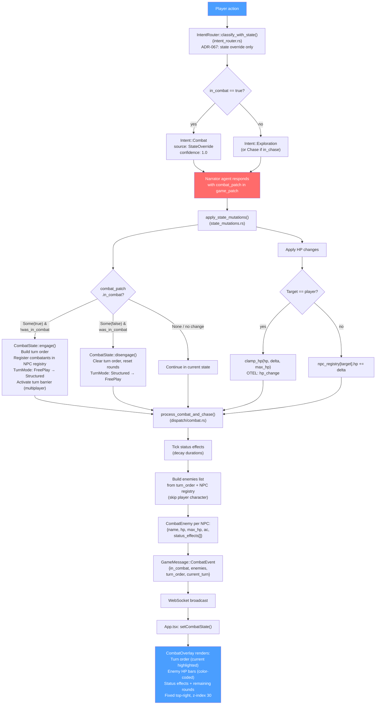

**No keyword matching** — combat detection is purely state-driven (ADR-067). `in_combat` flag in game state triggers Intent::Combat.

**Turn mode FSM:** `FreePlay` ↔ `Structured` (on combat start/end), `FreePlay` → `Cinematic` (on cutscene)

**CombatState tracks:** round counter, turn_order, current_turn, damage log, status effects (Poison/Stun/Bless/Curse with duration decay), drama_weight, available_actions

**HP bar colors:** green (>50%), orange (25-50%), red (<25%). Status indicators: "bloodied" at 50%, "defeated" at 0 HP.

**Status effect colors:** Poison (green), Stun (yellow), Bless (blue), Curse (purple)

---

## 8. Character Creation

Genre-driven scene-based state machine with bidirectional messages.

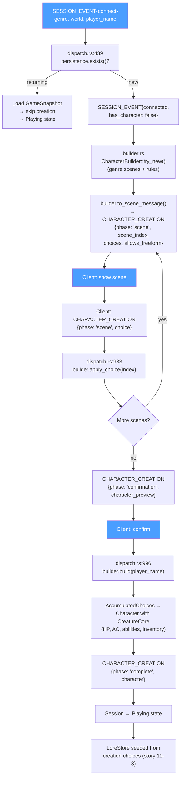

**Accumulated from scenes:** class, race, personality, items, affinity, backstory fragments, stat bonuses, pronouns, rig type, catch phrase

**3 creation modes (ADR-016):** Menu (pick from list), Guided (follow prompts), Freeform (describe anything)

---

## 9. Pacing & Drama Engine

Dual-track tension model drives narration length and delivery speed.

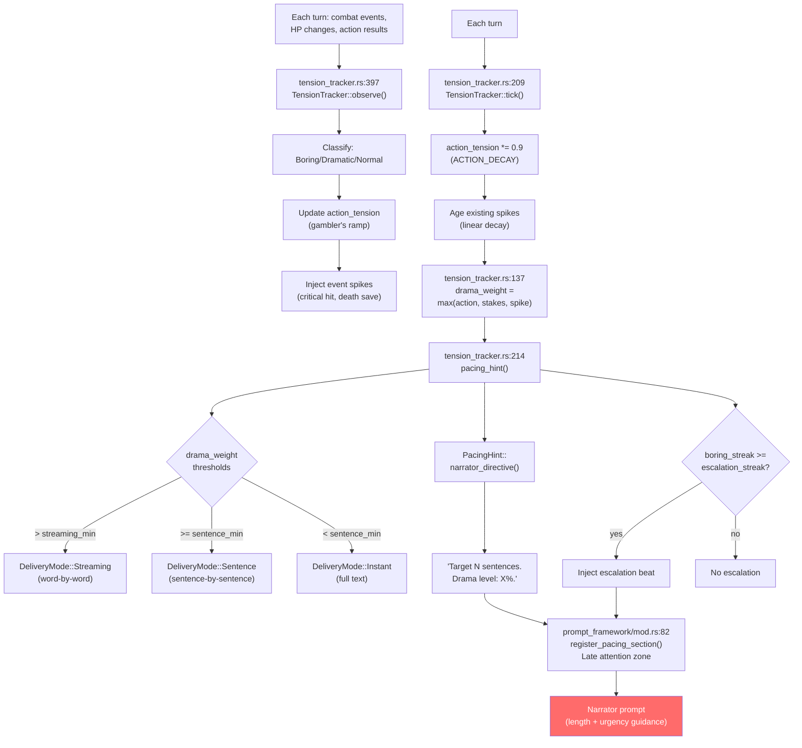

**Genre-tunable:** `pacing.yaml` in genre pack sets `streaming_delivery_min`, `sentence_delivery_min`, `escalation_streak`

**Dual tracks:** Action tension (gambler's ramp from boring streaks) + Stakes tension (HP ratio) + Event spikes (discrete dramatic moments)

---

## 10. Knowledge Pipeline

Narrator footnotes become persistent facts that feed back into future prompts.

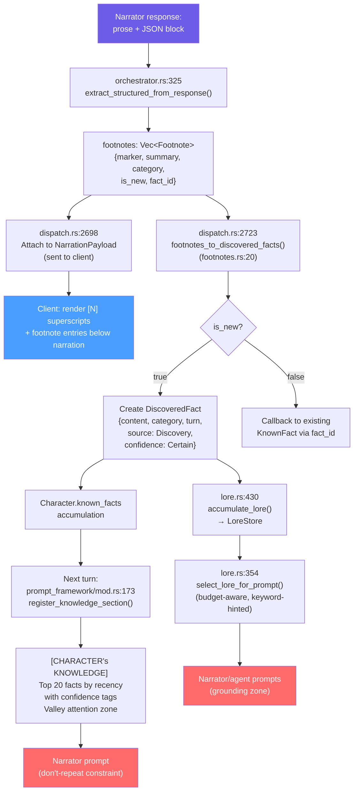

**FactCategory:** Lore, Place, Person, Quest, Ability

**Lore budget:** Token-aware selection prevents prompt bloat (content.len / 4 token estimate)

**Feedback loop:** Footnotes → KnownFacts → prompt injection → narrator avoids repeating → new footnotes

---

## 11. NPC Personality (OCEAN)

Big Five profiles loaded from genre packs, summarized into narrator prompts.

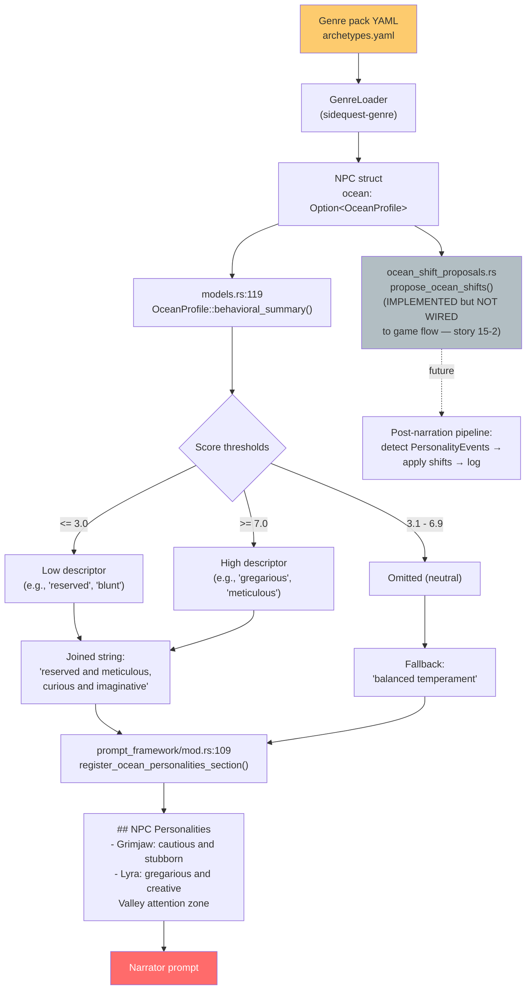

**5 dimensions:** Openness, Conscientiousness, Extraversion, Agreeableness, Neuroticism (0.0-10.0)

**Agreeableness → Disposition:** A-dimension feeds the existing -15 to +15 disposition system

**Gap:** OCEAN shift proposals are implemented but not wired into the game flow (Epic 15, story 15-2)

---

## 12. Faction Agendas & Scene Directives

Factions pursue goals that inject into every narrator turn.

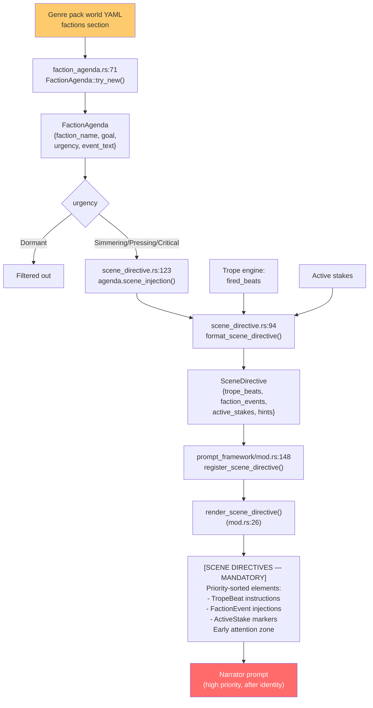

**Urgency levels:** Dormant (filtered), Simmering, Pressing, Critical

**Mandatory weave:** Scene directives use EARLY attention zone — narrator must incorporate them

---

## 13. Slash Commands

Server-side interception before intent classification.

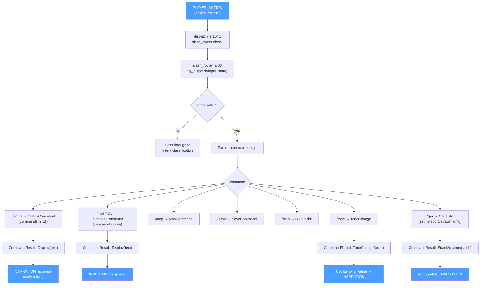

**No LLM call:** Slash commands resolve mechanically — no Claude subprocess, no intent classification

**GM commands:** Protected by role check, allow direct state manipulation for debugging

---

## 14. Trope Engine

Genre-defined narrative pacing via trope lifecycle and beat injection.

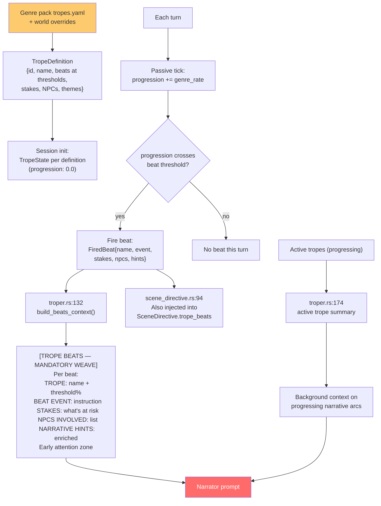

**Trope lifecycle:** Progression 0.0 → 1.0 with beats firing at defined thresholds

**Engagement multiplier:** Scale progression rate by player engagement (turns_since_meaningful)

---

## 15. Session Persistence

Atomic save after every turn, full recovery on reconnect.

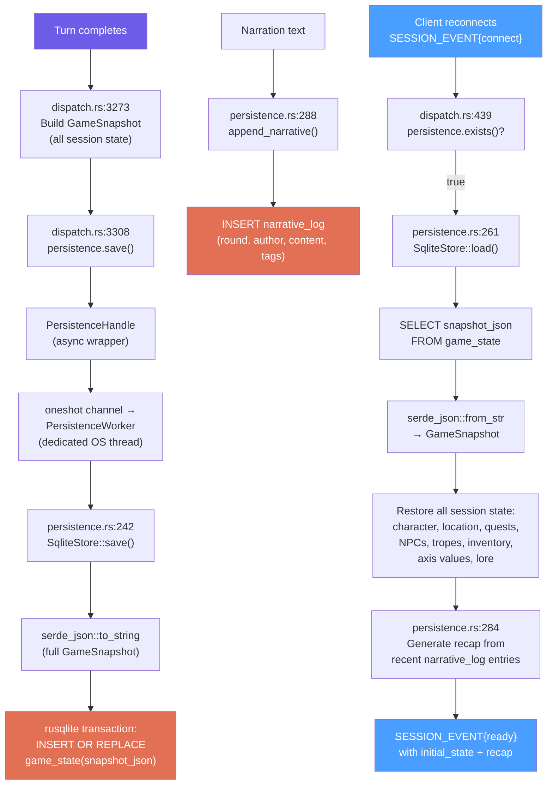

**Schema:** 3 tables — `session_meta`, `game_state` (single row, full JSON), `narrative_log` (append-only)

**Actor pattern:** `rusqlite::Connection` is `!Send` — wrapped in dedicated OS thread with mpsc command channel

**One DB per session:** `{save_dir}/{genre}/{world}/{player}/save.db`

**GameSnapshot includes:** characters, NPCs, combat, chase, tropes (full TropeState), quests, lore, axis values, achievements, campaign maturity, world history, NPC registry

---

## 16. Genre Pack Loading

Lazy binding — packs loaded per-session on connect, not at startup.

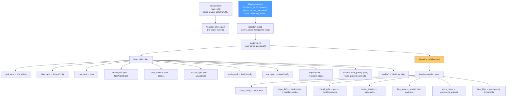

**15+ YAML files** per genre pack, all deserialized into typed Rust structs via serde_yaml

**World inheritance:** World-level overrides merge with genre-level defaults (tropes, visual style)

**Lazy binding (ADR-004):** Server starts genre-agnostic; genre bound at runtime on player connect

---

## Color Legend

```
Blue   (#4a9eff)  — Client/WebSocket messages (visible to player)
Purple (#6c5ce7)  — Internal data (narration text, results)
Red    (#ff6b6b)  — Claude CLI subprocess / narrator prompt
Green  (#00b894)  — Python daemon (Flux image gen)
Orange (#e17055)  — SQLite persistence
Yellow (#fdcb6e)  — YAML configuration (genre packs)
Gray   (#b2bec3)  — Not yet wired / stub
```
