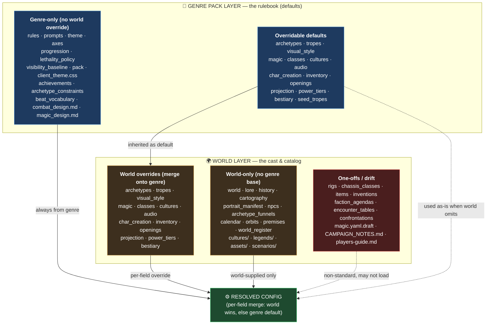

# Genre → World File Inheritance

How content resolves per ADR-121 (layered content resolution / per-field merge) and
ADR-140 (genre is the rulebook; the world owns the cast & catalog). The genre pack
supplies defaults; the world overrides per-field; the engine loads the merged result.

Three buckets:
- **Override pairs** — file exists at both levels; world merges over genre (the real inheritance surface).
- **Genre-only** — the rulebook; never overridden by worlds.
- **World-only** — per-world cast & catalog; no genre base.

## Override pairs (the inheritance surface)

These 14 files exist at both genre and world level, so a world file merges over the
genre default: `archetypes`, `tropes`, `visual_style`, `magic`, `classes`, `cultures`,
`audio`, `char_creation`, `inventory`, `openings`, `projection`, `power_tiers`,
`bestiary`, `seed_tropes`.
