# Per-Genre Runtime Inheritance — What Each World Actually Reads

Grounded in the real loader (`sidequest-server/sidequest/genre/loader.py`,
`magic_loader.py`, `orbital/loader.py`, `game/world_grounding_loader.py`), **not**
file presence. A world loads the **genre pack defaults**, then its own files override
per the rules below. Files that exist on disk but are never read are flagged.

## Legend / resolution rules

| Edge / box | Meaning |
|------------|---------|
| **genre required** | `pack, rules, progression, axes, prompts, visibility_baseline, lethality_policy` — must exist; always loaded (`loader.py:1547-1927`) |
| **genre optional (loaded)** | present optional genre files actually parsed |
| **world override → REPLACE** | world file fully replaces the genre list: `archetypes, cultures, bestiary, char_creation, classes, spells_wwn, chassis_classes, seed_tropes` (`pack.py:327-364`) |
| **world override → COMPOSE** | `magic.yaml` — per-field last-writer-wins + `hard_limits` append (`magic_loader.py:56-157`) |
| **world override → AUTHORITATIVE** | `theme, audio, visual_style, lore, tropes` — world value wins, genre is fallback (`loader.py:1167-1215`) |
| **world-only** | no genre base: `world, cartography, openings, history, npcs, archetype_funnels, rigs, items, portrait_manifest, premises, calendar, orbits, chart` |
| **globbed dirs** | `cultures/`, `legends/`, `scenarios/` scanned as directories (`loader.py:1118,1139,1326`); `.gitkeep`/`_meta.yaml` skipped |
| 🚫 **NOT read** | exists on disk, loader never opens it |

**Files that are NEVER read at runtime (project-wide):**
- All markdown: `combat_design.md`, `magic_design.md`, `CAMPAIGN_NOTES.md`, `players-guide.md`, `README.md`
- `*.draft` / `*.yaml.draft`, `premises.draft.yaml` (only `premises.yaml` is read)
- **`inventory.yaml`, `power_tiers.yaml`, `projection.yaml` at the WORLD level** — these are read **only at genre level** (`loader.py:1647,1622,1897`). World copies are dead.

---

## 1. caverns_and_claudes

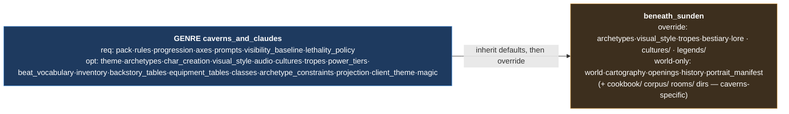

---

## 2. elemental_harmony

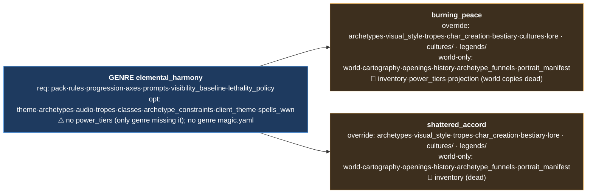

---

## 3. heavy_metal

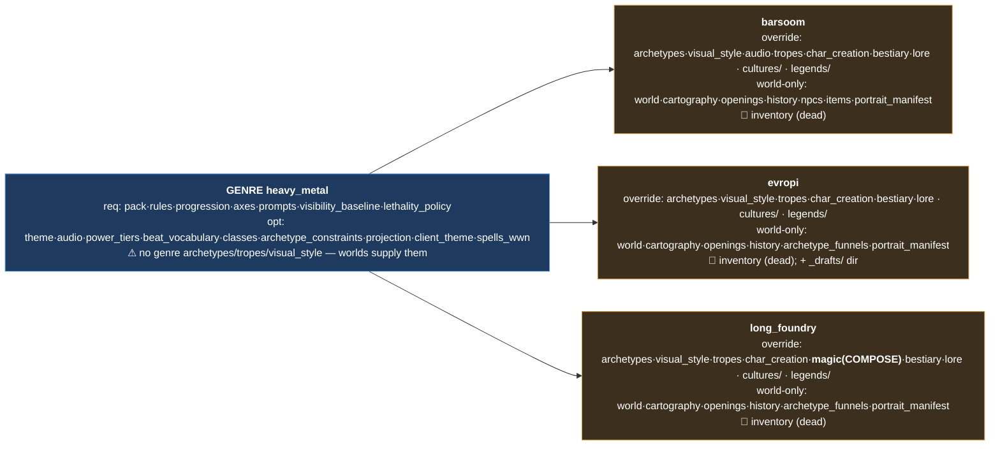

---

## 4. mutant_wasteland

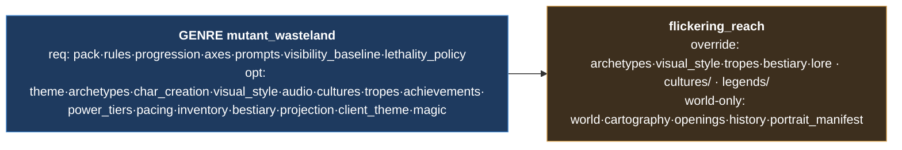

---

## 5. neon_dystopia

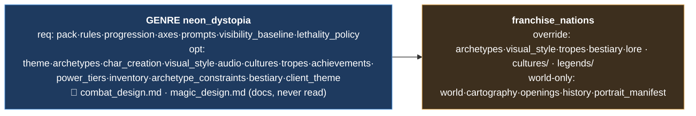

---

## 6. pulp_noir

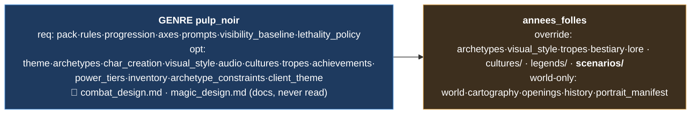

---

## 7. road_warrior

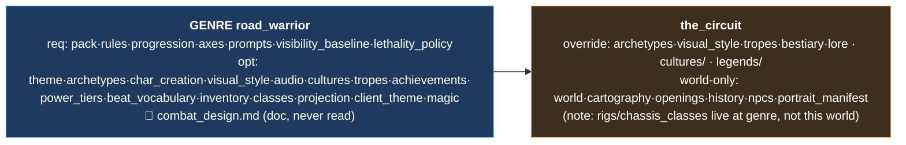

---

## 8. space_opera  *(richest — magic compose, rigs, orbital tier)*

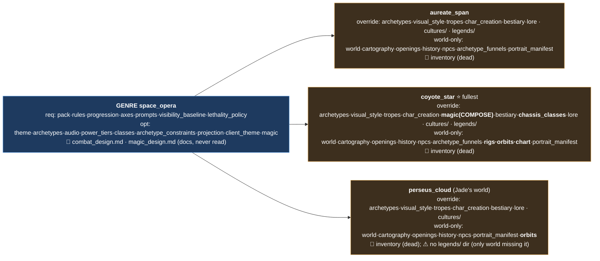

---

## 9. spaghetti_western

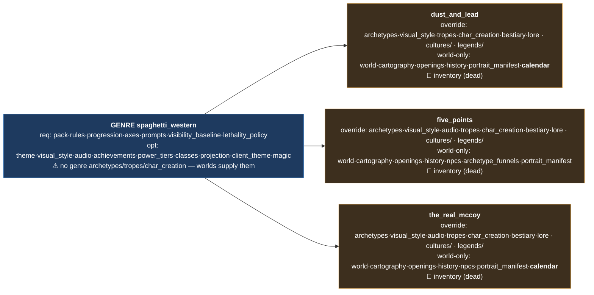

---

## 10. tea_and_murder  *(mystery — scenarios/ everywhere)*

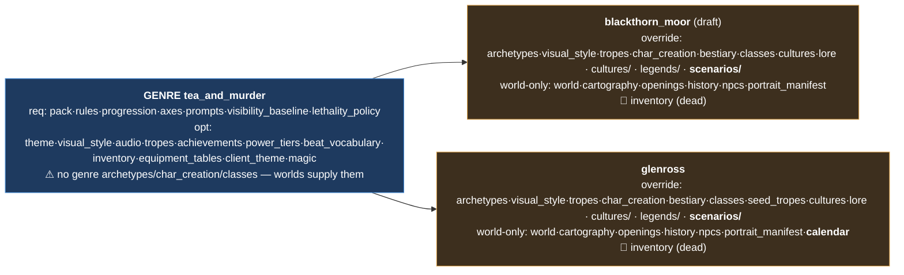

---

## 11. wry_whimsy  *(portal-fairytale — premises substrate)*

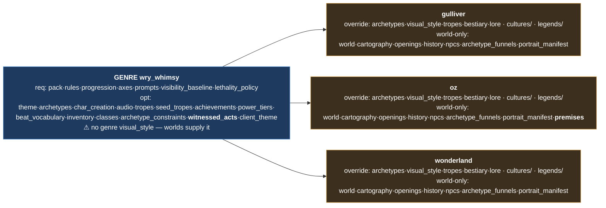

---

## Cross-genre runtime findings

1. **Dead world files (exist, never loaded):** `inventory.yaml` ships in 13 worlds but is read **only at genre level** — every world copy is dead. Same for the singleton world-level `power_tiers.yaml` and `projection.yaml` (both genre-only loaders). If a world wants custom loadout/economy it must do it at genre tier or via a different mechanism.
2. **`premises.draft.yaml` is never read** — only `premises.yaml` (gulliver/wonderland ship the draft name; oz ships the real one and is the only world whose premises actually load).
3. **`legends/` missing from perseus_cloud only** — every other world loads a legends dir; perseus_cloud silently has none.
4. **`magic.yaml` composition is live in exactly 2 worlds:** long_foundry and coyote_star (world magic composes over genre magic). Other genres ship a genre `magic.yaml` that loads with no world override.
5. **Orbital tier (orbits.yaml + chart.yaml) only in space_opera** — coyote_star (both) and perseus_cloud (orbits only). chart.yaml is coyote_star-exclusive.
6. **`*_design.md` never reach the engine** — `combat_design.md` (neon, pulp, road_warrior, space_opera) and `magic_design.md` (neon, pulp, space_opera) are pure docs.
7. **Genres relying on worlds for core content:** heavy_metal, spaghetti_western, space_opera, tea_and_murder, wry_whimsy each omit some of archetypes/tropes/visual_style/char_creation at genre level, requiring every world to supply them (no genre fallback → a new world that forgets them gets nothing).
