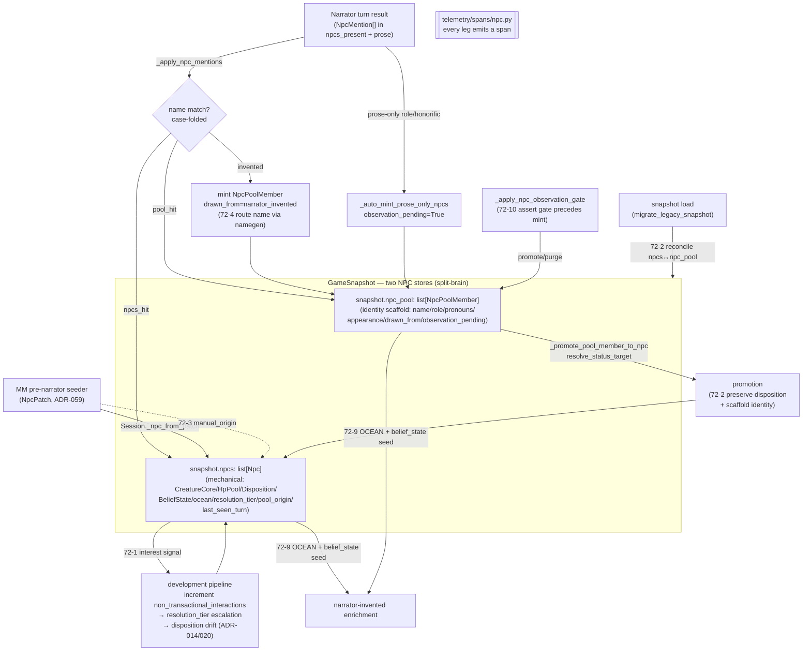

# Epic 72: NPC Identity Hardening

## Overview
An NPC in SideQuest has no stable identity key — it is a case-folded *name string* split
across two unreconciled stores (`snapshot.npcs` = mechanical state; `snapshot.npc_pool` =
identity scaffold) with no consistency invariant, and the development pipeline that should
deepen NPCs as the playgroup shows interest (weight escalation + disposition evolution +
interest counting) is dormant. This epic hardens NPC identity end-to-end: it revives the
dormant development pipeline, reconciles the two stores on load and on promotion, threads
provenance (`pool_origin`, `manual_origin`) through the merge seam, routes
narrator-invented names through ADR-091 culture-bound namegen, fixes the born-hostile
disposition default, caps/prunes pool growth, and makes identity drift authoritative
instead of warn-only — with OTEL on every leg so the GM panel can verify each fix fired.

**Priority:** P2
**Repo:** sidequest-server
**Stories:** 10 (32 points)

## Planning Documents
| Document | Relevant Sections |
|----------|-------------------|
| `docs/adr/014-diamonds-and-coal.md` | Coal→diamond promotion *on genuine player interest* (examine/ask) — the model the NPC development pipeline (72-1) is supposed to mirror but currently inverts. |
| `docs/adr/020-npc-disposition-system.md` | Numeric `disposition` → qualitative `attitude` mapping (`>10` friendly, `-10..10` neutral, `<-10` hostile); neutral spawn band; world-state agent patches deltas. Anchors 72-1 disposition drift, 72-2 disposition preservation, 72-5 spawn default, 72-9 OCEAN/disposition wiring. |
| `docs/adr/091-culture-corpus-markov-naming.md` | Culture-bound corpora → char-level Markov → template assembly via `sidequest/genre/names/` (`markov.py`, `generator.py`). The naming seam 72-4 routes narrator-invented names through. |
| `docs/adr/059-monster-manual-server-side-pregen.md` | MM creature pre-gen via `NpcPatch` injection seam (creature_id/threat_level/hp/abilities/morale). 72-3 adds `manual_origin` provenance preserved through this merge. |
| `docs/adr/042-ocean-personality-live-evolution.md` | OCEAN personality model + live evolution. 72-9 wires OCEAN onto narrator-invented NPCs. |
| `docs/adr/053-scenario-system.md` | `BeliefState` / belief seeding + gossip. 72-9 wires `belief_state` for narrator-invented NPCs. |
| `docs/superpowers/specs/2026-05-04-snapshot-split-brain-cleanup-design.md` | Wave 2A — the original split that created `npc_pool` vs `npcs`; the unreconciled-store root cause this epic closes. |

## Background

**Source: perseus_cloud session 894 (2026-05-29), sq-playtest-pingpong DEEP-DIVE #1.**

### The two-store identity split
NPC identity is currently modeled twice with no invariant binding the two representations.
`snapshot.npc_pool` (`list[NpcPoolMember]`, defined in `sidequest/game/npc_pool.py`) is the
*identity scaffold*: name / role / pronouns / appearance / `drawn_from` / `archetype_id` /
`observation_pending` — re-citable, regenerable, no mechanical state. `snapshot.npcs`
(`list[Npc]`, defined in `sidequest/game/session.py`) is the *mechanical state*: a full
`CreatureCore` with HP pool, `Disposition`, `BeliefState`, `ocean`, `resolution_tier`,
`last_seen_turn`/`last_seen_location`, and a `pool_origin` back-pointer. The only key joining
them is a **case-folded name string** matched ad hoc at each call site (`narration_apply._apply_npc_mentions`,
`subsystems/npc_agency.run_npc_agency`, `resolve_status_target`). There is no reconcile step,
so the same logical person can exist in both stores with divergent role/pronoun/disposition,
or be promoted from pool to `Npc` while losing scaffold-side identity fields.

### The dormant development pipeline (backwards from ADR-014/020)
Promotion from pool scaffold to stateful `Npc` fires **only on mechanical necessity** — a
status mutation needing a `CreatureCore` (`resolve_status_target` →
`_promote_pool_member_to_npc`) or a combat/MM stat block (`Session._npc_from_patch`). It
**never** fires on *player interest*, which is exactly backwards from ADR-014 (coal→diamond
promotes when the player examines/asks) and ADR-020 (disposition evolves through interaction).
The `Npc.resolution_tier` field is hard-`"spawn"` and never escalates; `non_transactional_interactions`
is declared but never incremented; disposition drift only happens via explicit narrator
`npc_attitudes` deltas, never as an emergent function of repeated engagement. An NPC the
playgroup talks to for ten turns stays a flat `"spawn"`-tier scaffold unless they happen to
get hit in combat.

### Identity-correctness defects
Several narrowly-scoped correctness bugs ride on the same seam: narrator-invented NPCs are
minted with `drawn_from="narrator_invented"` and **bare names** that bypass ADR-091
culture-bound namegen (72-4); creature materialization applies a `-20` born-hostile
disposition default that the narrator-invented path also inherits, spawning hostile NPCs that
should be neutral (72-5, `_npc_from_patch` line ~1533); identity drift (`_detect_npc_identity_drift`)
is **warn-only** — it emits `npc.reinvented` at `severity="warning"` but never overwrites the
canonical pronoun/role on re-mention (72-7); `last_seen_turn`/`last_seen_location` stamp only
on prose mention, not on structured encounter presence (72-8); and the `npc_pool` grows
unbounded with no LRU/last-seen cap or stale-`observation_pending` prune (72-6). The
`observation_pending` ratification gate already has the right shape but its load-bearing
ordering (gate must run before mint) is only enforced by a comment, not an assert (72-10).
Every one of these is a place where the engine silently improvises identity that the OTEL
lie-detector cannot currently see.

## Technical Architecture

### Component map

### Data flow: scaffold → promoted Npc → developed
1. **Mint.** Narrator names a person. If the name is in neither store, `_apply_npc_mentions`
   (`narration_apply.py` ~line 1292) appends an `NpcPoolMember(drawn_from="narrator_invented")`
   and fires `npc.referenced(match_strategy="invented")` + `npc.auto_registered`. Prose-only
   role/honorific mentions instead go through `_auto_mint_prose_only_npcs`
   (`session_helpers.py:1728`) with `observation_pending=True`.
2. **Ratify.** Next turn, `_apply_npc_observation_gate` (`session_helpers.py:1912`) promotes
   (clears flag) or purges the pending member based on this turn's `npcs_present`. Ordering is
   load-bearing — gate before mint (72-10).
3. **Promote.** When the name first needs mechanical state (status mutation, combat, MM patch),
   `_promote_pool_member_to_npc` (`narration_apply.py:916`) or `Session._npc_from_patch`
   (`session.py:1501`) builds an `Npc` carrying `pool_origin = member.name`. The pool entry
   stays (shadowed by the `Npc` lookup).
4. **Develop.** (72-1, new) On each engagement that isn't a transaction, increment
   `Npc.non_transactional_interactions`, escalate `resolution_tier` past `"spawn"` at thresholds,
   and drift `Disposition` per ADR-020 — mirroring ADR-014's interest-driven coal→diamond promotion.

### Interface contracts
- **`NpcPoolMember`** (`sidequest/game/npc_pool.py`) — identity scaffold. `drawn_from` ∈
  `{name_generator, world_authored, legacy_registry, narrator_invented, dialogue_extraction}`;
  `observation_pending` ratification flag. 72-4 adds the `name_generator` route at mint;
  72-6 adds LRU/last-seen cap + stale-pending prune.
- **`Npc`** (`sidequest/game/session.py:120`) — mechanical state. Fields this epic activates:
  `resolution_tier` (currently hard `"spawn"`, 72-1), `non_transactional_interactions`
  (declared, never incremented — 72-1), `disposition: Disposition` (72-1 drift, 72-2 preserve,
  72-5 spawn default), `ocean`/`belief_state` (72-9), `last_seen_turn`/`last_seen_location` (72-8).
- **`NpcPatch`** (`sidequest/game/session.py:282`) — the MM/narrator injection patch. 72-3 adds
  `manual_origin` and preserves it through `_npc_from_patch` onto the materialized `Npc` so the
  GM panel can attribute MM-seeded NPCs. The born-hostile default lives here at
  `_npc_from_patch` line ~1533 (`disposition=-20 if is_creature else 0`) — 72-5 fixes the
  narrator-invented path so non-creatures spawn neutral.
- **Promotion seam** — `_promote_pool_member_to_npc` (`narration_apply.py:916`) currently builds
  a fresh `Npc` and **does not carry disposition** from any prior pool/state. 72-2 makes it
  preserve disposition and full scaffold identity, and adds a **load-time reconcile** pass
  alongside `migrate_legacy_snapshot` (`game/migrations.py`, `_migrate_s2_npc_registry_split`)
  to enforce a single-source-of-truth invariant between `npcs` and `npc_pool`.
- **Drift seam** — `_detect_npc_identity_drift` (`session_helpers.py:2004`) is warn-only; 72-7
  changes the pool-hit upsert in `_apply_npc_mentions` (~line 1259) from additive-only
  (fill-empty) to authoritative overwrite of canonical pronoun/role on re-mention.
- **Namegen seam** — `sidequest/genre/names/generator.py::build_from_culture` /
  `NameGenerator.generate_person`, already exposed as the `generate_name` tool
  (`sidequest/agents/tools/generate_name.py`). 72-4 routes the `match_strategy="invented"` mint
  through this culture-bound generator instead of accepting the narrator's bare name.
- **npc_agency dispatch** — `run_npc_agency` (`agents/subsystems/npc_agency.py`) resolves roster
  (`npcs`) first, pool second, and surfaces ADR-020 disposition in its directive; the 72-1
  development signal and 72-9 enrichment must be readable here.

### OTEL span points (every leg)
All NPC spans live in `sidequest/telemetry/spans/npc.py`. Existing spans this epic must keep
firing and extend: `npc.referenced` (`match_strategy` ∈ npcs_hit/pool_hit/invented),
`npc.auto_registered`, `npc.auto_minted_from_prose`, `npc.auto_mint_skipped`,
`npc.observation_gate_promoted` / `npc.observation_gate_purged`, `npc.reinvented` (drift),
`npc.recurring_presence_missed`, `npc.edge_published`, and the `state_transition`
`field="npcs", op="promoted_from_pool"` watcher event. **New spans required:**
- 72-1: a development-tick span on each interest increment — emit `non_transactional_interactions`
  count, old/new `resolution_tier`, disposition before/after + `crossed` (parallel to the existing
  `disposition.shift` route at `session.py:1410`).
- 72-2: a reconcile span on load (members merged / conflicts resolved) and disposition-preserved
  attribute on the `promoted_from_pool` event.
- 72-3: `manual_origin` attribute on the materialization span.
- 72-4: namegen-routed mint span (culture id + generated name vs narrator's bare name).
- 72-5: spawn-disposition span recording the corrected default.
- 72-6: pool-cap eviction + stale-pending prune spans (severity=warning for drops, mirroring
  `observation_gate_purged`).
- 72-7: convert `npc.reinvented` from warn-only to an *applied* span (overwrite recorded).
- 72-8: stamp `last_seen_*` on encounter-presence span, not just prose mention.
- 72-9: OCEAN/belief_state seed span for narrator-invented NPCs.
- 72-10: assert (test-enforced) that the gate runs before the minter — an OTEL span-ordering
  assertion is the refactor-stable wiring test (per server CLAUDE.md "No Source-Text Wiring Tests").

### Story → component map
| Story | Pts | Primary file(s) / seam |
|-------|-----|------------------------|
| 72-1 Revive development pipeline (interest increment, tier escalation, disposition drift, OTEL) | 8 | `session.py` (`Npc.resolution_tier`, `non_transactional_interactions`, `Disposition`), `narration_apply._apply_npc_mentions`, `subsystems/npc_agency.py`, new dev-tick span in `telemetry/spans/npc.py` |
| 72-2 Preserve disposition on promotion + reconcile npcs↔npc_pool on load | 5 | `narration_apply._promote_pool_member_to_npc` (line 916), `game/migrations.py` (`_migrate_s2_npc_registry_split` / new reconcile pass), `session.py` load hook |
| 72-3 MM NPC provenance — `NpcPatch.manual_origin` preserved through merge | 3 | `session.py::NpcPatch` (line 282) + `_npc_from_patch` (1501), `server/dispatch/pregen.py`, `monster_manual_inject.py` |
| 72-4 Route narrator-invented names through ADR-091 namegen | 5 | `narration_apply._apply_npc_mentions` invented branch (~1292), `genre/names/generator.py::build_from_culture`, `agents/tools/generate_name.py` |
| 72-5 Fix born-hostile default (-20 → neutral spawn) | 2 | `session.py::_npc_from_patch` line ~1533; `world_materialization.py` disposition seeding |
| 72-6 Cap npc_pool growth (LRU/last-seen) + prune stale observation_pending | 3 | `game/npc_pool.py`, `narration_apply` mint paths, new cap/prune span |
| 72-7 Apply identity drift — overwrite canonical pronoun/role on re-mention | 3 | `narration_apply._apply_npc_mentions` pool-hit upsert (1271–1278), `session_helpers._detect_npc_identity_drift` (2004) |
| 72-8 Stamp last_seen_turn/location on encounter presence | 2 | `narration_apply._apply_npc_mentions` (1241–1242), encounter handshake seam (`npc.edge_published` path) |
| 72-9 Wire OCEAN/disposition + scenario belief_state for invented NPCs | 5 | `session.py::Npc.ocean`/`belief_state`, `world_materialization.py`, ADR-042/053 seeding |
| 72-10 observation_pending gate-ordering assert (gate precedes mint) | 1 | `narration_apply.py` (~line 2494 gate call before `_auto_mint_prose_only_npcs` at ~2518); span-ordering test |

## Cross-Epic Dependencies

**Depends on:**
- **ADR-014 (Diamonds and Coal)** — interest-driven promotion model the development pipeline (72-1) mirrors.
- **ADR-020 (NPC Disposition System)** — disposition→attitude mapping + neutral band (72-1, 72-2, 72-5, 72-9).
- **ADR-091 (Culture-Corpus Markov Naming)** — `genre/names/` generator + `generate_name` tool that 72-4 routes through; requires a culture bound on the world pack.
- **ADR-059 (Monster Manual server-side pre-gen)** — `NpcPatch` injection seam 72-3 threads `manual_origin` through.
- **ADR-042 (OCEAN live evolution)** / **ADR-053 (Scenario System / BeliefState)** — enrichment surfaces 72-9 wires.
- **Wave 2A snapshot split-brain cleanup spec (2026-05-04)** — created the two stores; this epic closes the unreconciled-store gap it left open.
- **ADR-031 / 090 / 103 (OTEL)** — span/watcher infrastructure every leg emits into.

**Depended on by:**
- The Intent Router / `npc_agency` dispatch (ADR-113) — a developed, tier-escalated, disposition-stable NPC makes `run_npc_agency` directives mechanically grounded instead of narrator improv, which the post-narration `dispatch_engagement_watcher` lie-detector validates.
- Sebastien/Jade mechanical-visibility surfaces — the new development-tick and reconcile spans feed the GM panel so the playgroup's mechanics-first players can see NPC depth advance.
- Any future scenario/gossip work (ADR-053) — a single stable NPC identity is the precondition for per-NPC belief propagation.
