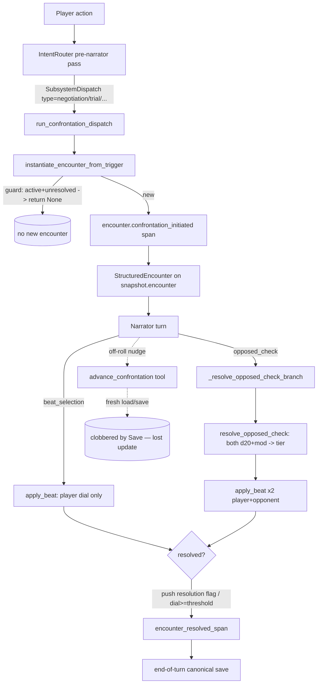

# Epic 73: Confrontation Engine Hardening

## Overview
Generalize the `social_duel` fix from Story 59-8 across the rest of the
tea_and_murder social-confrontation family. 59-8 converted `social_duel` to
`resolution_mode: opposed_check` and made it resolvable (added an always-resolves
withdraw beat, hardened the dial path); its siblings — `negotiation`, `scandal`,
`trial` — still run the default `beat_selection` mode where only the player rolls
and the opponent dial moves only by narrator fiat through the
`advance_confrontation` tool. This epic ports the opposed-check recipe to the
siblings (with per-confrontation ADR-093 recalibration), closes a `trial`
soft-lock, fixes a real lost-update in `advance_confrontation`, makes a
no-dial-move push CritSuccess read as intended for mechanics-first players, and
suppresses a cosmetic span re-fire on the resolution turn.

**Priority:** P2
**Repo:** sidequest-server, sidequest-content
**Stories:** 5 (14 points)

## Planning Documents
| Document | Relevant Sections |
|----------|-------------------|
| `docs/adr/033-confrontation-engine-resource-pools.md` | Confrontation engine, dual-dial momentum, resource pools — the base architecture the dials live in |
| `docs/adr/093-confrontation-difficulty-calibration.md` | Tie-band geometry, opponent stat parity ceiling (≤10), opposed_check threshold=7 — the calibration each converted sibling must satisfy |
| `docs/adr/116-confrontation-requires-an-other.md` | Participant membership invariant; `_requires_opponent` folds `opposed_check` in so a converted social confrontation seats an opponent-side Other |
| `docs/adr/117-pluggable-ruleset-module-system.md` | `RulesetModule` seam (native vs swn); native owns the dial/opposed-check path these recipes drive |
| `docs/adr/114-ablative-hp-substrate.md` | HP damage channel on beats — orthogonal to these dial-only social confrontations, but the `apply_beat` resolution-flag handling (73-2/73-4) lives alongside it |
| `.archive/handoffs/opposed-checks-design.md` | Original opposed-check resolution design (both sides roll d20+mod, tier from shift) |
| `sprint/context/context-epic-59.md` (Story 59-8) | The reference fix this epic generalizes |

## Background
Story 59-8 (Glenross playtest, `sq-playtest-pingpong`) found that the
tea_and_murder Duel of Wits (`social_duel`) could never resolve on the opponent's
side. Under the default `beat_selection` resolution mode, only the **player** rolls
a d20; the opponent's dial advances only when the narrator calls the
`advance_confrontation` write tool with a hand-picked delta. Two consequences:
the Other's `barbs_landed` dial froze at 0 (so the duel could never end on the
opponent's victory), and there was no honest mechanical signal — the GM panel saw
"Claude said delta=2" rather than a real opposed roll. 59-8 converted `social_duel`
to `resolution_mode: opposed_check` (both duellists roll d20+modifier each beat,
tier derived from the shift per the ADR-093 bands), authored an
`opponent_default_stats` block so the location-seated Other has a stat block to
roll against, recalibrated the dial threshold from 5→7, and added an
always-resolves `concede` beat (`resolution: true`) to kill a soft-lock where a
failed concede roll trapped the player in a duel the fiction had already closed.

The follow-ups this epic addresses were flagged during that fix but left for a
dedicated pass:

- **The siblings never got the upgrade.** `negotiation`, `scandal`, and `trial`
  still run `beat_selection` with frozen opponent dials. They have the same
  structural unfairness `social_duel` had — a Conflict resolved by a Challenge
  resolver (only the player rolls). `negotiation` already carries a `walk_away`
  push with `resolution: true` (added defensively in 59-8's wake), but it still
  rolls one-sided.
- **`trial` has no mid-trial exit (soft-lock risk).** Its four beats are
  `cross_examine` / `present_argument` (strike), `object` (brace), `yield`
  (angle). None is a `push` and none carries `resolution: true`. If neither
  conviction dial reaches threshold 8, there is no terminal beat — the same
  soft-lock class 59-8 closed for `social_duel` and `negotiation`.
- **`advance_confrontation` has a live lost-update.** The tool does
  `ctx.repository.load()` → mutate `metric.current` → `ctx.repository.save(snapshot)`
  on a **fresh** load, not the canonical per-turn snapshot. The end-of-turn save
  in the narration pipeline then writes the canonical snapshot back over it,
  clobbering the dial advance. (Converting siblings to opposed_check reduces
  reliance on this tool, but it remains the narrator's only lever for off-roll
  dial nudges and must be correct.)
- **A push CritSuccess scores 0 on the dial.** `BeatKind.push` CritSuccess sets
  `{resolution: True, grants_fleeting_tag: "Clean Exit"}` with `own=0`/`opponent=0`
  — by design (a clean exit doesn't "win" the dial), but Sebastien/Jade read the
  0 as a broken roll. The beat-kind impact needs to be legible so a no-dial-move
  crit reads as *intended*.
- **A cosmetic span re-fires on the resolution turn.** When the player's final
  action resolves a confrontation, the intent router still classifies it as a
  confrontation and re-dispatches, re-emitting an
  `encounter.confrontation_initiated` signal even though no new encounter is
  created. GM-panel noise.

## Technical Architecture

### Component relationships

The confrontation family is authored entirely in
`sidequest-content/genre_packs/tea_and_murder/rules.yaml` under `confrontations:`.
Each entry is a `ConfrontationDef` (`sidequest/genre/models/rules.py`) carrying a
`resolution_mode`, a `player_metric`/`opponent_metric` `MetricDef` pair, and a list
of `BeatDef`s. Two resolution paths matter here:

- **`beat_selection` (default):** player rolls one d20; `apply_beat`
  (`sidequest/game/beat_kinds.py`) advances the player dial from the tier. The
  opponent dial only moves via the `advance_confrontation` write tool. This is
  what `negotiation` / `scandal` / `trial` run today.
- **`opposed_check` (59-8 target):** both sides roll d20+modifier;
  `_resolve_opposed_check_branch` (`sidequest/server/narration_apply.py:4118`)
  calls `resolve_opposed_check` (`sidequest/game/opposed_check.py`) to derive a
  single tier from the shift, emits `encounter.opposed_roll_resolved`, then calls
  `apply_beat` once per side. The opponent's modifier is sourced from the seated
  actor's `per_actor_state['stats']` or, for a location-seated Other with no sheet,
  from the cdef's `opponent_default_stats` (fail-loud if neither carries the stat).
  `_requires_opponent` (`encounter_lifecycle.py:369`) folds `opposed_check` in so
  the Other is seated `side="opponent"` (ADR-116), letting its dial advance on its
  own roll.

### Key files
| File | Repo | Role | Stories |
|------|------|------|---------|
| `genre_packs/tea_and_murder/rules.yaml` | content | The four confrontation recipes (`negotiation`, `trial`, `social_duel`, `scandal`, plus `auction`). `social_duel` is the reference shape (opposed_check + opponent_default_stats ≤10 + threshold 7 + `concede` resolution beat) | 73-1, 73-2 |
| `sidequest/game/opposed_check.py` | server | `resolve_opposed_check`, shift→tier bands, `resolve_opponent_modifier` (stat sourcing: per-actor → cdef default, fail-loud) | 73-1, 73-2 |
| `sidequest/server/narration_apply.py` | server | `_resolve_opposed_check_branch` (line 4118), the per-side `apply_beat` calls, `encounter_resolved_span`, beat-kind reporting (line ~3199) | 73-1, 73-2, 73-4 |
| `sidequest/game/beat_kinds.py` | server | `BeatKind`, `DEFAULT_DELTAS` (push CritSuccess = `{resolution:True}`, no dial move), `resolve_tier_deltas`, `apply_beat` resolution-flag honoring (line 860) | 73-2, 73-4 |
| `sidequest/agents/tools/advance_confrontation.py` | server | The WRITE tool with the lost-update: `load()` → mutate `metric.current` → `save(snapshot)` on a fresh snapshot | 73-3 |
| `sidequest/agents/tool_registry.py` | server | `ToolContext` (`ctx.repository`, `ctx.otel_span`); the canonical-snapshot seam advance_confrontation must route through | 73-3 |
| `sidequest/server/dispatch/encounter_lifecycle.py` | server | `instantiate_encounter_from_trigger` (the `encounter.confrontation_initiated` span at line 904 + the active-unresolved early-return guard), `_requires_opponent` (folds opposed_check into opponent-seating) | 73-1, 73-5 |
| `sidequest/agents/subsystems/confrontation.py` | server | `run_confrontation_dispatch` — the router→engine entry that re-dispatches on the resolution turn | 73-5 |
| `sidequest/telemetry/spans/encounter.py` | server | `encounter_confrontation_initiated_span` (line 424), `SPAN_ENCOUNTER_CONFRONTATION_INITIATED`; `encounter_opposed_roll_resolved_span`, `encounter_metric_advance_span` | 73-1, 73-5 |
| `sidequest/genre/models/rules.py` | server | `ConfrontationDef`, `MetricDef`, `BeatDef` (`resolution: bool | None` override at line 151), `ResolutionMode` enum, `opponent_default_stats` + `opponent_ability_scores()` | 73-1, 73-2 |
| `tests/genre/test_confrontation_calibration.py` | server | ADR-093 guardrail: every `opposed_check` confrontation MUST have both thresholds == 7 and every `opponent_default_stats` value ≤ 10. **Converting siblings sweeps them into this test** | 73-1, 73-2 |

### Data flow of a confrontation turn (initiate → advance → resolve)
1. **Initiate.** `IntentRouter` emits a `SubsystemDispatch(subsystem="confrontation", params={"type": "<type>"})`. `run_dispatch_bank` calls `run_confrontation_dispatch`, which calls `instantiate_encounter_from_trigger`. That seats the player + (for opposed_check/adversarial) an opponent-side Other from `npcs_present` or the location fallback, stamps `StructuredEncounter` onto `snapshot.encounter`, and emits `encounter.confrontation_initiated` (line 904) inside the `if current is None or current.resolved` guard. If an active unresolved encounter already exists, the function returns `None` early — **no second span** at that seam.
2. **Advance.** The narrator runs against the now-real encounter. Under `opposed_check`, `_resolve_opposed_check_branch` rolls both d20s, derives the tier, emits `encounter.opposed_roll_resolved`, and calls `apply_beat` for each side. Under `beat_selection`, only the player dial advances from `apply_beat`; the narrator may call `advance_confrontation` to nudge the opponent dial.
3. **Resolve.** `apply_beat` sets `enc.resolved` when a dial crosses its threshold **or** a beat carries the `resolution` flag (`DEFAULT_DELTAS[push][Success/CritSuccess].resolution` or `BeatDef.resolution` override, honored at `beat_kinds.py:860`). On resolution the pipeline fires `encounter_resolved_span` and writes the canonical snapshot at end of turn.

### Interface contracts
- **opposed_check recipe shape (target for the siblings).** Match `social_duel`:
  `resolution_mode: opposed_check`; an `opponent_default_stats` block keyed by the
  same stat names the beats' `stat_check` uses (e.g. `Cunning`, `Nerve`, `Pride`,
  `Passion`), every value **≤ 10** (ADR-093 parity ceiling — challenge comes from
  dial/DC geometry, not stat inflation); `player_metric.threshold ==
  opponent_metric.threshold == 7` (ADR-093 opposed_check calibration). The
  `tests/genre/test_confrontation_calibration.py` guardrail enforces both the
  ≤10 ceiling and the ==7 threshold the moment a confrontation declares
  `opposed_check`, so 73-1/73-2 must recalibrate as part of the conversion
  (`trial` 8→7; `scandal` 5/8 — note its asymmetric `containment`/`exposure`
  dials need a deliberate calibration decision, not a blind 7-stamp). A
  terminal `push` beat with `resolution: true` for the voluntary exit.
- **Canonical-snapshot save seam (the lost-update site, 73-3).** Today
  `advance_confrontation` does `session = ctx.repository.load()` then
  `ctx.repository.save(session.snapshot)` — a fresh load/save pair. The end-of-turn
  save in the narration pipeline operates on the **canonical** per-turn snapshot and
  clobbers it. The fix routes the mutation through the canonical snapshot the rest
  of the turn writes (the `ToolContext`-reachable in-flight snapshot), not a fresh
  load — mirroring how `apply_beat`-driven dial moves persist. This is a real
  lost-update, not a race: the clobber is deterministic ordering.
- **Span emission (73-5).** `encounter.confrontation_initiated` should fire **once**
  per encounter — at creation. On a resolution turn the router re-dispatches and
  `run_confrontation_dispatch` re-enters `instantiate_encounter_from_trigger`, which
  returns `None` at the active-unresolved guard (no span at line 904). The cosmetic
  re-fire is the INFO-level `encounter.confrontation_initiated` log emitted from the
  narrator extraction path (`orchestrator.py:3094`/`3350`) when the extraction still
  reports `confrontation=<type>` on the resolving turn. 73-5 suppresses the re-fired
  signal on the resolution turn (gate on "encounter already active for this type" /
  "this turn resolves rather than initiates") so the GM panel sees a single clean
  initiation per encounter.
- **Beat-kind legibility (73-4).** A `push` CritSuccess intentionally moves no dial
  (`own=0`/`opponent=0`, `resolution=True`, fleeting tag "Clean Exit"). Make the
  beat-kind impact legible so the 0 reads as *clean exit, by design* rather than
  *broken roll*: surface the kind's semantic outcome (resolution/tag) in the
  player-facing mechanical readout and in the OTEL/`beat_kind` reporting at
  `narration_apply.py:~3199` and `beat_kinds.py:~791`, so Sebastien/Jade see "push
  CritSuccess → clean exit (no dial change, by design)" instead of an unexplained 0.

### Story → component map
- **73-1** (negotiation + scandal → opposed_check, per-confrontation ADR-093 balance) → `rules.yaml` recipe edits + `opposed_check.py`/`_resolve_opposed_check_branch` exercise + `test_confrontation_calibration.py` (must stay green). Author `opponent_default_stats` (≤10) for both; recalibrate thresholds to 7 (decide scandal's asymmetric dials deliberately).
- **73-2** (trial: withdraw/concede beat + opposed_check) → `rules.yaml` `trial` def (add a `push` beat with `resolution: true` mirroring `social_duel.concede`; convert to opposed_check; threshold 8→7; add `opponent_default_stats` for `Cunning`/`Passion`) + `apply_beat` resolution-flag path (already honors the flag at `beat_kinds.py:860`).
- **73-3** (advance_confrontation lost-update) → `advance_confrontation.py` + `tool_registry.py` `ToolContext` — route the mutation through the canonical snapshot, not a fresh load/save the end-of-turn save clobbers. Add/verify an OTEL assertion that the advance persists past end-of-turn.
- **73-4** (push/angle CritSuccess legibility) → `beat_kinds.py` `DEFAULT_DELTAS` + the beat-kind impact reporting in `narration_apply.py`/`beat_kinds.py` — make a no-dial-move crit's intent legible (player UI mechanical readout + OTEL). Player-facing crunch for Sebastien/Jade; **not** a license to change the dial math.
- **73-5** (suppress re-fired confrontation_initiated span) → `confrontation.py` `run_confrontation_dispatch` / `orchestrator.py:3094`+`3350` extraction log — gate the initiation signal so it fires once per encounter, not again on the resolution turn.

## Cross-Epic Dependencies
**Depends on:**
- **Story 59-8** (the reference fix) — `social_duel` → opposed_check + resolvable. This epic is the explicit generalization of 59-8 across the family; its recipe is the template.
- **ADR-033** (confrontation engine / dual-dial momentum) — the dial substrate.
- **ADR-093** (difficulty calibration) — the ≤10 stat ceiling and threshold==7 the converted siblings must satisfy; enforced by `tests/genre/test_confrontation_calibration.py`.
- **ADR-116** (a confrontation requires an Other) — `_requires_opponent` already folds opposed_check into opponent-seating, so a converted social confrontation seats its Other correctly.
- **ADR-117** (pluggable rulesets) — these recipes run under the `native` ruleset's dial/opposed-check path; SWN/CWN packs are unaffected.
- **Epic 59** (Intent Router) — confrontations are now router-dispatched; 73-5 specifically lives at the router→engine re-dispatch seam.

**Depended on by:**
- The tea_and_murder / Glenross playtest line (Keith + Jade as forever-GMs; Sebastien/Jade as the mechanics-first players whose missing crunch this serves). Drawing-room social confrontations are this pack's primary mechanical surface.
- Any future pack authoring social confrontations against the calibration guardrail — the converted siblings become the worked examples of an opposed_check social recipe.
